# agent-workflow — Análisis técnico de flujos y arquitectura

> **Qué es este documento.** Referencia técnica comprensiva del harness `@tacuchi/agent-workflow-cli`: su arquitectura, el lifecycle universal de sesiones, los flujos posibles (core/dev/design/analyze), el catálogo de comandos y skills, el modelo de artefactos, la graduación a `docs/`, los modos project/hub y los hooks. Todos los diagramas son **Mermaid** (renderizan nativo en GitHub).
>
> **Audiencia.** Mantenedores y contribuidores del harness.
> **Generado por.** `session003-analyze-harness-flow-analysis` (flow=analyze, modality=technical), 2026-05-31.
> **Versiones analizadas.** CLI `@tacuchi/agent-workflow-cli` **v11.0.1** · SKILL bundleada (root) **v1.2.0** · skill `session` **v4.4.0** · workflows dev **v2.2.1** / analyze **v2.2.0** / design **v2.2.0** · plugin wrapper `.claude-plugin/plugin.json` **v7.0.1**.
> **Método.** Lectura directa de `src/` + `skills/agent-workflow/` + verificación de claims contra el código fuente. Las inconsistencias código-vs-doctrina detectadas están en la [§13](#13-hallazgos-inconsistencias-código-vs-doctrina).

---

## Índice

1. [Resumen ejecutivo](#1-resumen-ejecutivo)
2. [Arquitectura del sistema](#2-arquitectura-del-sistema)
3. [El lifecycle universal (4 fases)](#3-el-lifecycle-universal-4-fases)
4. [Los flujos (core/dev/design/analyze)](#4-los-flujos-coredevdesignanalyze)
5. [Modelo de artefactos](#5-modelo-de-artefactos)
6. [Modelo de graduación](#6-modelo-de-graduación)
7. [Modos: project vs hub](#7-modos-project-vs-hub)
8. [Hooks](#8-hooks)
9. [Verificación interactiva de ramas](#9-verificación-interactiva-de-ramas)
10. [Una sesión dev end-to-end](#10-una-sesión-dev-end-to-end)
11. [Catálogo de comandos del CLI](#11-catálogo-de-comandos-del-cli)
12. [Catálogo de slash-commands y doctrina](#12-catálogo-de-slash-commands-y-doctrina)
13. [Hallazgos: inconsistencias código vs doctrina](#13-hallazgos-inconsistencias-código-vs-doctrina)
14. [Glosario y referencias](#14-glosario-y-referencias)

---

## 1. Resumen ejecutivo

`agent-workflow` es un **harness de ciclo de vida de sesiones de IA** compuesto por tres piezas con líneas de versión independientes:

| Pieza | Qué es | Forma | Versión |
|---|---|---|---|
| **CLI** `@tacuchi/agent-workflow-cli` | Runtime ejecutable (motor). 48 subcomandos. Devuelve JSON. | TypeScript ESM, Node 20+, bins `agent-workflow` / `aw` | 11.0.1 |
| **SKILL** `agent-workflow` (bundleada) | Manual AI-facing: enseña al modelo cuándo/cómo invocar el CLI y la doctrina del lifecycle. | Markdown (frontmatter Anthropic Skill) en `skills/agent-workflow/` | 1.2.0 |
| **Plugin** wrapper | Hosta los slash-commands `/agent-workflow:*` y la SKILL en el marketplace. | `.claude-plugin/plugin.json` | 7.0.1 |

La idea central: **el CLI es agnóstico y no contiene lógica de negocio**; la **doctrina** (cómo conducir una sesión) vive en la SKILL como markdown; el **modelo** (Claude Code, Codex, etc.) lee la doctrina y orquesta el CLI vía shell. Todo el estado de trabajo vive en el filesystem del workspace bajo `.<namespace>/`.

El **lifecycle universal** tiene 4 fases — `planning → execution → validation → closure` — y es el mismo para todos los flujos; lo que cambia entre flujos es **qué especialidades se componen** y **qué artefactos se producen**.

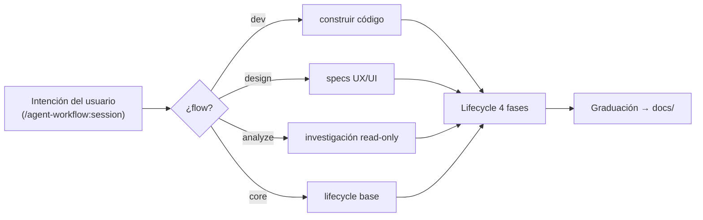
```mermaid
flowchart LR
    intent["Intención del usuario<br/>(/agent-workflow:session)"] --> flow{"¿flow?"}
    flow -->|dev| dev["construir código"]
    flow -->|design| des["specs UX/UI"]
    flow -->|analyze| ana["investigación read-only"]
    flow -->|core| core["lifecycle base"]
    dev --> life["Lifecycle 4 fases"]
    des --> life
    ana --> life
    core --> life
    life --> grad["Graduación → docs/"]
```

---

## 2. Arquitectura del sistema

### 2.1 Capas macro

Cuatro capas en runtime, más una opcional (plugin downstream):

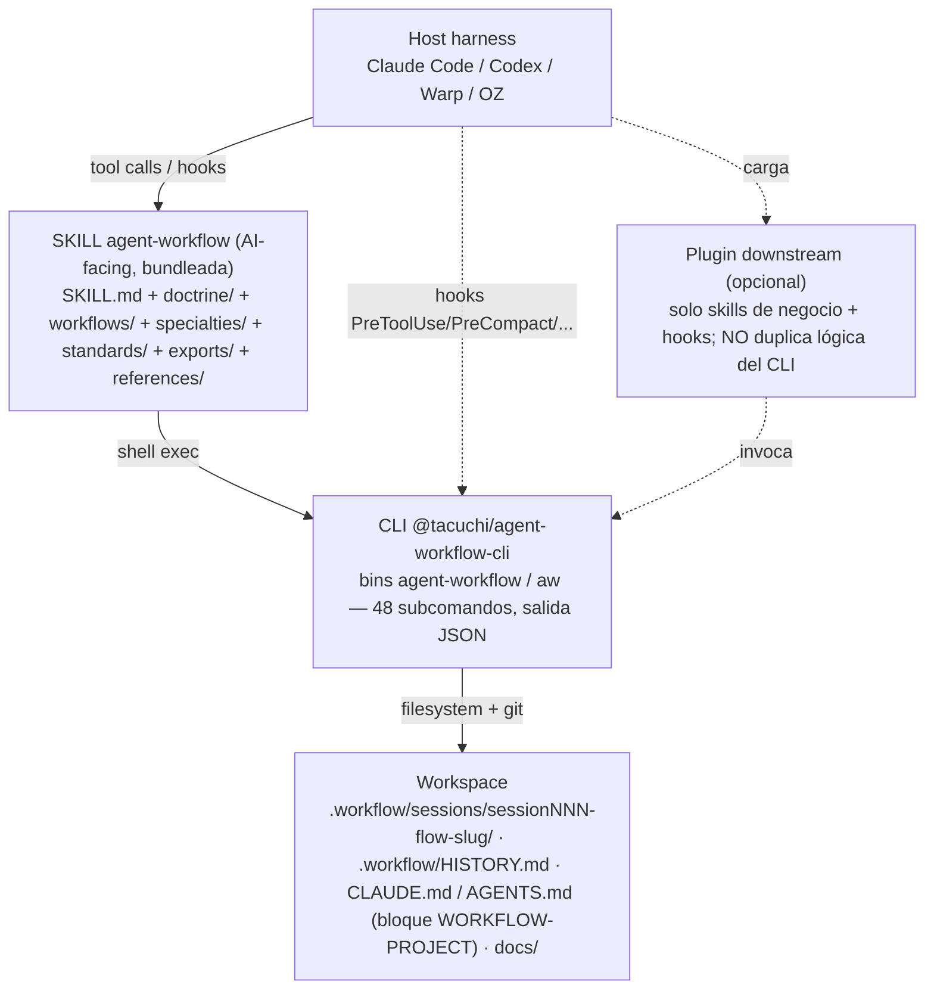
```mermaid
flowchart TB
    host["Host harness<br/>Claude Code / Codex / Warp / OZ"]
    skill["SKILL agent-workflow (AI-facing, bundleada)<br/>SKILL.md + doctrine/ + workflows/ + specialties/ + standards/ + exports/ + references/"]
    cli["CLI @tacuchi/agent-workflow-cli<br/>bins agent-workflow / aw — 48 subcomandos, salida JSON"]
    ws["Workspace<br/>.workflow/sessions/sessionNNN-flow-slug/ · .workflow/HISTORY.md · CLAUDE.md / AGENTS.md (bloque WORKFLOW-PROJECT) · docs/"]
    plugin["Plugin downstream (opcional)<br/>solo skills de negocio + hooks; NO duplica lógica del CLI"]

    host -->|tool calls / hooks| skill
    skill -->|shell exec| cli
    cli -->|filesystem + git| ws
    host -.->|hooks PreToolUse/PreCompact/...| cli
    plugin -.->|invoca| cli
    host -.->|carga| plugin
```

- El **host** invoca al modelo y dispara **hooks** (que a su vez llaman al CLI).
- La **SKILL** es la doctrina; no ejecuta nada por sí misma — instruye al modelo.
- El **CLI** es el único que toca filesystem + git, y siempre devuelve JSON por stdout.
- El **workspace** es la fuente de verdad persistente (sobrevive a `/compact`).

### 2.2 Arquitectura hexagonal del CLI

El CLI es un hexágono estricto: la dependencia apunta hacia adentro. `domain` no depende de nada; `cli` es la raíz de composición que cablea los adapters a los ports.

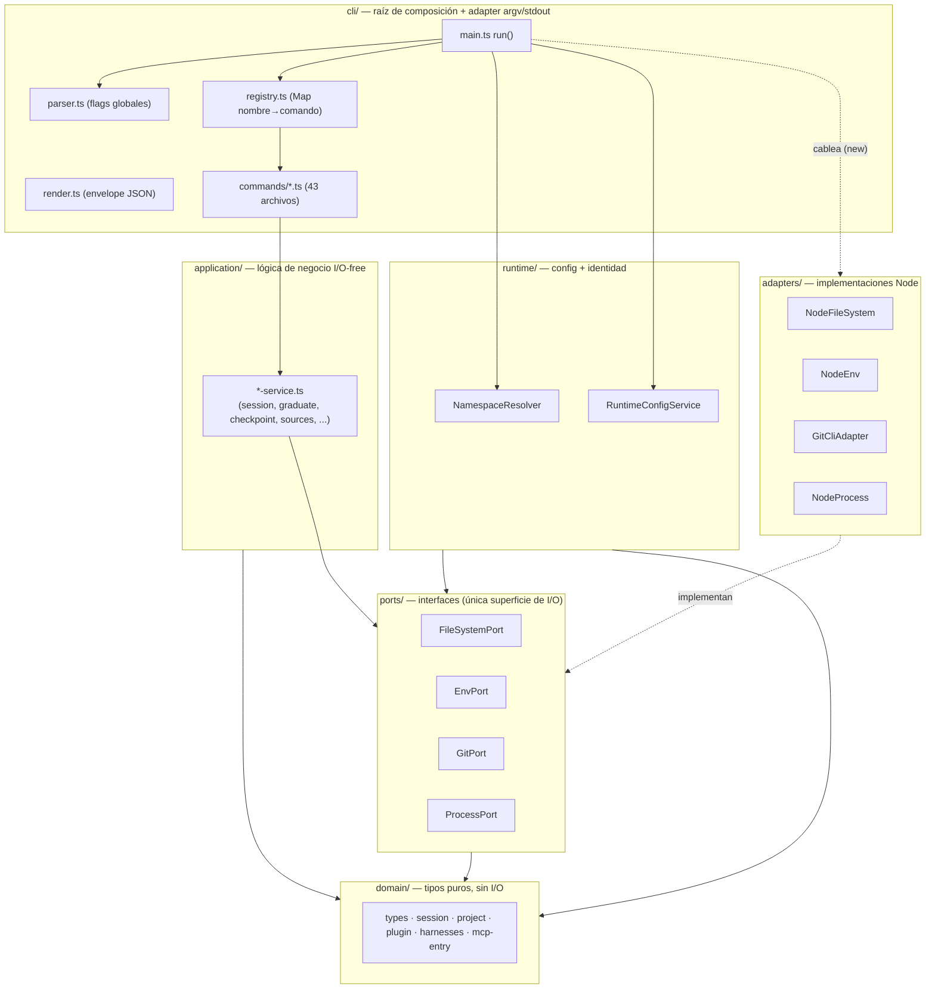
```mermaid
flowchart TB
    subgraph cli["cli/ — raíz de composición + adapter argv/stdout"]
      main["main.ts run()"]
      parser["parser.ts (flags globales)"]
      registry["registry.ts (Map nombre→comando)"]
      render["render.ts (envelope JSON)"]
      cmds["commands/*.ts (43 archivos)"]
    end
    subgraph app["application/ — lógica de negocio I/O-free"]
      svc["*-service.ts<br/>(session, graduate, checkpoint, sources, ...)"]
    end
    subgraph rt["runtime/ — config + identidad"]
      ns["NamespaceResolver"]
      cfg["RuntimeConfigService"]
    end
    subgraph ports["ports/ — interfaces (única superficie de I/O)"]
      p1["FileSystemPort"]
      p2["EnvPort"]
      p3["GitPort"]
      p4["ProcessPort"]
    end
    subgraph adapters["adapters/ — implementaciones Node"]
      a1["NodeFileSystem"]
      a2["NodeEnv"]
      a3["GitCliAdapter"]
      a4["NodeProcess"]
    end
    subgraph domain["domain/ — tipos puros, sin I/O"]
      d["types · session · project · plugin · harnesses · mcp-entry"]
    end

    main --> parser
    main --> registry --> cmds --> svc
    main --> ns
    main --> cfg
    svc --> ports
    rt --> ports
    adapters -. implementan .-> ports
    main -. cablea (new) .-> adapters
    app --> domain
    ports --> domain
    rt --> domain
```

**Contrato `CliContext`** (`src/cli/types.ts`): cada comando recibe `{ fs, env, git, process, runtime, namespace, paths }`. Se construye **una vez** por invocación en `main.ts run()`: instancia los 4 adapters (`GitCliAdapter` envuelve `ProcessPort`), resuelve `namespace`, deriva `PathsService` y `runtime`. Los comandos implementan `QtcCommand.execute(args, ctx)` y pasan los ports individuales a los servicios.

**Capas y dependencias** (para mantenimiento):

| Capa | Depende de | Contenido clave |
|---|---|---|
| `domain/` | nada | `Flow` (core/dev/design/analyze), `Phase` (4 fases), `CommandResult<T>`, `QtcError`, `WorkspaceMode`, `HARNESSES` |
| `ports/` | domain | `FileSystemPort`, `EnvPort`, `GitPort`, `ProcessPort` (no hay clock port) |
| `adapters/` | ports + Node | `NodeFileSystem` (write atómico vía tmp+rename), `NodeEnv`, `GitCliAdapter`, `NodeProcess` |
| `runtime/` | ports + domain | `NamespaceResolver`, `RuntimeConfigService`, `Namespace` (branded, regex `^[a-z][a-z0-9-]{1,30}$`) |
| `application/` | ports + domain + runtime | servicios `*-service.ts` + subdirs `session/ graduate/ checkpoint/ multiroot/ render/ parsers/ profile/ release-data/ plugin-doctor/ self/` |
| `cli/` | todo | raíz de composición; único lugar con `new` de adapters |

> Excepciones a la regla de ports (a tener en cuenta al refactorizar): `application/self/*` importa el tipo `CliContext` del CLI y usa `node:fs/promises` directo; `application/multiroot/{claude,codex,warp}.ts` usan `node:fs` síncrono. Son los únicos módulos de `application/` que rompen el límite de ports.

### 2.3 Contrato de salida JSON

Todo subcomando emite **JSON pretty (2 espacios) por stdout**:

- **Éxito con datos** → el objeto `data` **crudo** (no envuelto en `{ok:true}`).
- **Éxito sin datos** (`data===undefined`) → el comando ya escribió stdout él mismo (ej. `auto-plan-decide` preserva floats).
- **Error** → `{ "ok": false, "error": { "code", "message", "details?" } }`, exit code ≠ 0.
- **stderr** se reserva para relayar stderr de procesos hijos (ej. `aw hook`).

Validación **manual, sin Zod** (DEC-001): se lanza `Error` con `code`+`message` y la capa CLI (`main.ts`) lo convierte en el envelope. Idiom `exactOptionalPropertyTypes`: propiedades opcionales vía `{ ...(x !== undefined ? { x } : {}) }`.

### 2.4 Resolución de namespace

El namespace controla dónde viven las sesiones (`.<ns>/`), el bloque project (`<NS>-PROJECT`) y el user root (`~/.<ns>/`). Precedencia **real en código** (`src/runtime/namespace-resolver.ts`):

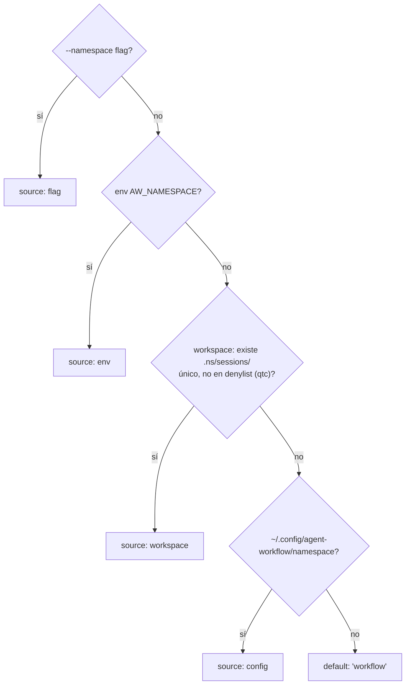
```mermaid
flowchart TD
    f{"--namespace flag?"} -->|sí| use1["source: flag"]
    f -->|no| e{"env AW_NAMESPACE?"}
    e -->|sí| use2["source: env"]
    e -->|no| w{"workspace: existe .ns/sessions/<br/>único, no en denylist (qtc)?"}
    w -->|sí| use3["source: workspace"]
    w -->|no| c{"~/.config/agent-workflow/namespace?"}
    c -->|sí| use4["source: config"]
    c -->|no| use5["default: 'workflow'"]
```

> ⚠️ **Dos correcciones vs la doctrina escrita** (ver [§13](#13-hallazgos-inconsistencias-código-vs-doctrina)): (1) el default en código es **`workflow`**, no `agent-workflow`; (2) la **autodetección de workspace** ocurre **antes** que el user-config, y se basa en la existencia del directorio `.<ns>/sessions/` (no en el bloque `<NS>-PROJECT`). En este repo `aw self namespace` → `{"namespace":"workflow","source":"workspace"}`.

---

## 3. El lifecycle universal (4 fases)

Una sesión es una carpeta `.<ns>/sessions/sessionNNN-<flow>-<slug>/` + una fila en `HISTORY.md` + una entrada en el bloque `<NS>-PROJECT`. El entry point **único** es `/agent-workflow:session`.

### 3.1 Resolución de intención

`/agent-workflow:session` evalúa `$ARGUMENTS` en orden:

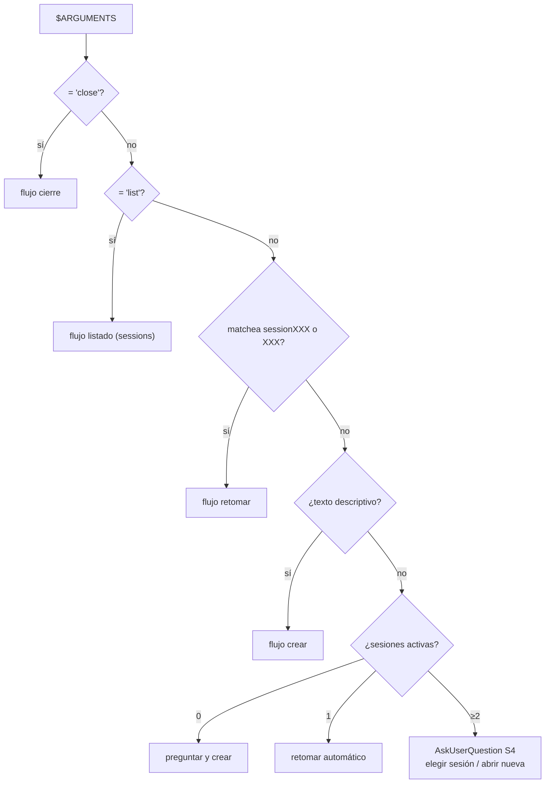
```mermaid
flowchart TD
    args["$ARGUMENTS"] --> c1{"= 'close'?"}
    c1 -->|sí| close["flujo cierre"]
    c1 -->|no| c2{"= 'list'?"}
    c2 -->|sí| list["flujo listado (sessions)"]
    c2 -->|no| c3{"matchea sessionXXX o XXX?"}
    c3 -->|sí| resume["flujo retomar"]
    c3 -->|no| c4{"¿texto descriptivo?"}
    c4 -->|sí| create["flujo crear"]
    c4 -->|no| c5{"¿sesiones activas?"}
    c5 -->|0| ask0["preguntar y crear"]
    c5 -->|1| auto["retomar automático"]
    c5 -->|≥2| s4["AskUserQuestion S4<br/>elegir sesión / abrir nueva"]
```

### 3.2 Crear sesión

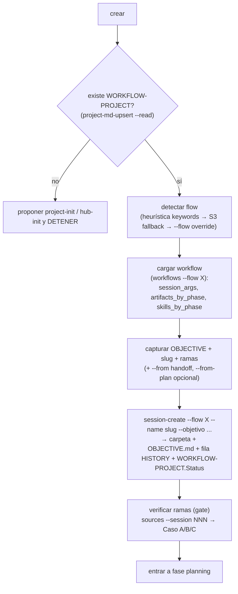
```mermaid
flowchart TD
    start["crear"] --> proj{"existe WORKFLOW-PROJECT?<br/>(project-md-upsert --read)"}
    proj -->|no| initp["proponer project-init / hub-init y DETENER"]
    proj -->|sí| flow["detectar flow<br/>(heurística keywords → S3 fallback → --flow override)"]
    flow --> wf["cargar workflow<br/>(workflows --flow X):<br/>session_args, artifacts_by_phase, skills_by_phase"]
    wf --> capture["capturar OBJECTIVE + slug + ramas<br/>(+ --from handoff, --from-plan opcional)"]
    capture --> screate["session-create --flow X --name slug --objetivo ...<br/>→ carpeta + OBJECTIVE.md + fila HISTORY + WORKFLOW-PROJECT.Status"]
    screate --> branch["verificar ramas (gate)<br/>sources --session NNN → Caso A/B/C"]
    branch --> planning["entrar a fase planning"]
```

### 3.3 Las 4 fases

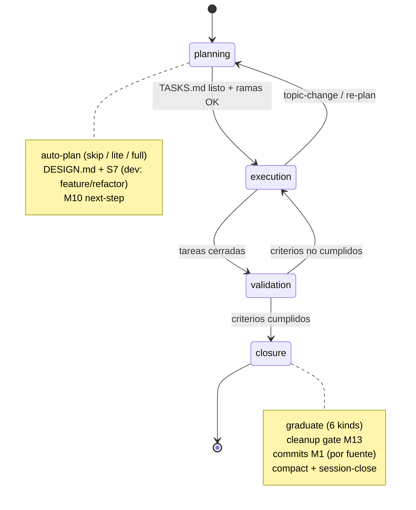
```mermaid
stateDiagram-v2
    [*] --> planning
    planning --> execution: TASKS.md listo + ramas OK
    execution --> validation: tareas cerradas
    validation --> closure: criterios cumplidos
    closure --> [*]
    execution --> planning: topic-change / re-plan
    validation --> execution: criterios no cumplidos
    note right of planning
      auto-plan (skip / lite / full)
      DESIGN.md + S7 (dev: feature/refactor)
      M10 next-step
    end note
    note right of closure
      graduate (6 kinds)
      cleanup gate M13
      commits M1 (por fuente)
      compact + session-close
    end note
```

| Fase | Qué pasa | Drivers CLI | Artefactos |
|---|---|---|---|
| **planning** | OBJECTIVE + TASKS. Auto-plan decide skip/lite/full. No editar código antes de TASKS. | `auto-plan-decide`, `specialty-choose`, `objetivo-data`, `tasks-data` | `OBJECTIVE.md`, `TASKS.md` (+ `DESIGN.md` en dev feature/refactor) |
| **execution** | El trabajo. Loop por tarea. Topic-change detection. | `tasks-data --only-open`, `topic-change-check`, `check-branch` | `DECISIONS.md`, `scripts/`, artefactos por flow |
| **validation** | Verifica criterios. Tests si aplica. No automática. | `tasks-data --only-open`, `phase-detect` | logs, marcado en TASKS |
| **closure** | Graduación + cleanup + commits + compact + close. | `graduate`, `sources`, `checkpoint-write`, `session-close` | artefactos en `docs/`, `CHECKPOINT.md`, fila `closed` |

### 3.4 Planning — detalle

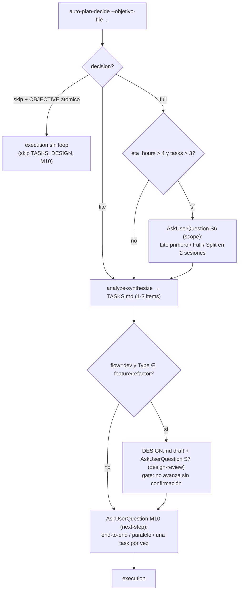
```mermaid
flowchart TD
    ap["auto-plan-decide --objetivo-file ..."] --> dec{"decision?"}
    dec -->|skip + OBJECTIVE atómico| exec0["execution sin loop<br/>(skip TASKS, DESIGN, M10)"]
    dec -->|lite| tasks["analyze-synthesize → TASKS.md (1-3 items)"]
    dec -->|full| s6{"eta_hours > 4 y tasks > 3?"}
    s6 -->|sí| s6q["AskUserQuestion S6 (scope):<br/>Lite primero / Full / Split en 2 sesiones"]
    s6 -->|no| tasks
    s6q --> tasks
    tasks --> typ{"flow=dev y Type ∈ feature/refactor?"}
    typ -->|sí| design["DESIGN.md draft + AskUserQuestion S7 (design-review)<br/>gate: no avanza sin confirmación"]
    typ -->|no| m10
    design --> m10["AskUserQuestion M10 (next-step):<br/>end-to-end / paralelo / una task por vez"]
    m10 --> execution
```

El **Plan subagent nativo** (CC `Task(subagent_type="Plan")`) es opcional: se usa para estructurar TASKS.md si `aw harness` reporta `supports_plan_subagent:true`; en Codex/unknown se cae al fallback (redactar TASKS directo). También existe un **sub-agente per-flow** opt-in (`aw profiles` → `delegate_to_subagent`), que delega todo el loop de execution a un `Task(subagent_type="<flow>-agent")`.

### 3.5 Execution — loop

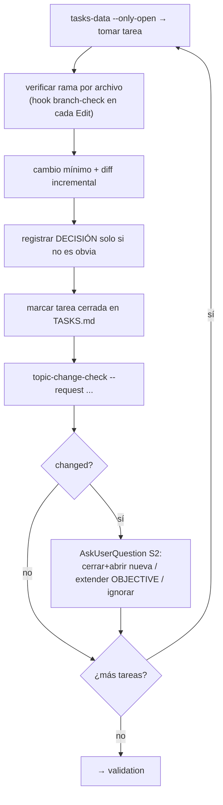
```mermaid
flowchart TD
    t["tasks-data --only-open → tomar tarea"] --> br["verificar rama por archivo<br/>(hook branch-check en cada Edit)"]
    br --> diff["cambio mínimo + diff incremental"]
    diff --> dec["registrar DECISIÓN solo si no es obvia"]
    dec --> mark["marcar tarea cerrada en TASKS.md"]
    mark --> tc["topic-change-check --request ..."]
    tc --> changed{"changed?"}
    changed -->|sí| s2["AskUserQuestion S2:<br/>cerrar+abrir nueva / extender OBJECTIVE / ignorar"]
    changed -->|no| more{"¿más tareas?"}
    s2 --> more
    more -->|sí| t
    more -->|no| validation["→ validation"]
```

### 3.6 Closure

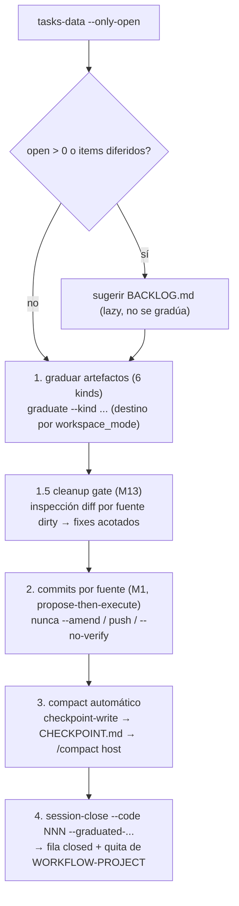
```mermaid
flowchart TD
    open["tasks-data --only-open"] --> backlog{"open > 0 o items diferidos?"}
    backlog -->|sí| bl["sugerir BACKLOG.md (lazy, no se gradúa)"]
    backlog -->|no| grad
    bl --> grad["1. graduar artefactos (6 kinds)<br/>graduate --kind ... (destino por workspace_mode)"]
    grad --> clean["1.5 cleanup gate (M13)<br/>inspección diff por fuente dirty → fixes acotados"]
    clean --> commits["2. commits por fuente (M1, propose-then-execute)<br/>nunca --amend / push / --no-verify"]
    commits --> compact["3. compact automático<br/>checkpoint-write → CHECKPOINT.md → /compact host"]
    compact --> sclose["4. session-close --code NNN --graduated-...<br/>→ fila closed + quita de WORKFLOW-PROJECT"]
```

> **Cierre sin implementación (F-E.1)** es válido si hay `OBJECTIVE.md` + al menos uno de `CONCLUSIONS.md` / `DELIVERY.md` / `DESIGN.md`. Caso típico: una sesión analyze que produjo conclusiones y difiere el dev a otra sesión.

### 3.7 Modo lite (`/patch`) — micro-lifecycle

No es un flow nuevo: es un **modo de `flow=dev`** (`session-create --lite`). Ceremonia reducida para fixes/chores acotados (1-3 archivos, sin arquitectura).

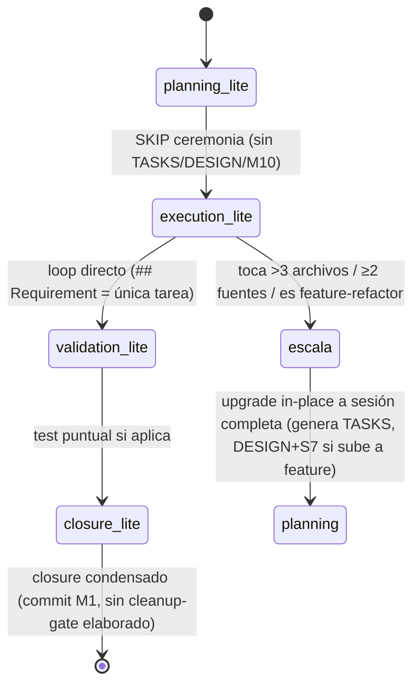
```mermaid
stateDiagram-v2
    [*] --> planning_lite
    planning_lite --> execution_lite: SKIP ceremonia (sin TASKS/DESIGN/M10)
    execution_lite --> validation_lite: loop directo (## Requirement = única tarea)
    validation_lite --> closure_lite: test puntual si aplica
    closure_lite --> [*]: closure condensado (commit M1, sin cleanup-gate elaborado)
    execution_lite --> escala: toca >3 archivos / ≥2 fuentes / es feature-refactor
    escala --> planning: upgrade in-place a sesión completa (genera TASKS, DESIGN+S7 si sube a feature)
```

- `## Type` default `bugfix` (`chore` si la heurística lo detecta); `--lite` **rechaza** `feature|refactor`.
- Tag `kind:patch` en la columna refs de HISTORY; los exports colapsan los patches para no inflar informes.
- **No gradúa** por default.

### 3.8 Sandbox plan-mode

Durante plan mode el lifecycle entero queda **en pausa**: el skill **describe** las acciones en el plan file en vez de ejecutarlas (qué carpeta/archivos crearía, output esperado de `auto-plan-decide`, lista de archivos a editar, artefactos a graduar). Sub-comandos plan-mode-safe (read-only): `project-md-upsert --read`, `sessions`, `auto-plan-decide`, `specialty-choose`, `topic-change-check`, `session-resume`, `checkpoint-read`, `objetivo-data`, `tasks-data`, `decisiones-list`, `session-artifacts`.

---

## 4. Los flujos (core/dev/design/analyze)

El `Flow` es un enum del dominio (`core | dev | design | analyze`). Determina el prefijo del slug, los `session_args` extra, y **qué especialidades se componen por fase**. Los flows **no son repos separados** desde la consolidación v2.0.0 — son agrupaciones de skills dentro de la SKILL bundleada. (Los plugins `core/developer/design/analyze-workflow-plugin` son la forma de distribución/legado que `doctor` health-checkea.)

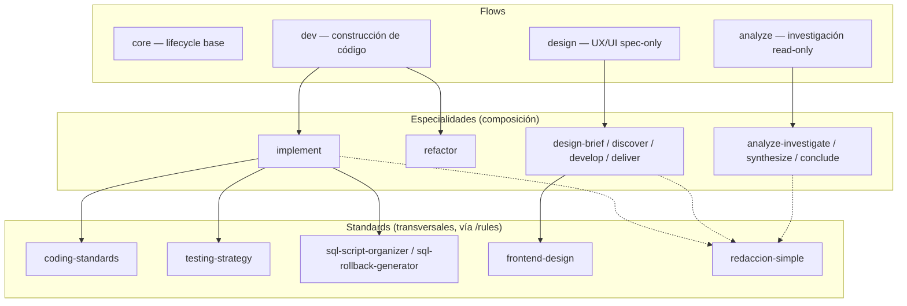
```mermaid
flowchart TB
    subgraph flows["Flows"]
      core["core — lifecycle base"]
      dev["dev — construcción de código"]
      design["design — UX/UI spec-only"]
      analyze["analyze — investigación read-only"]
    end
    subgraph spec["Especialidades (composición)"]
      impl["implement"]
      refac["refactor"]
      db["design-brief / discover / develop / deliver"]
      an["analyze-investigate / synthesize / conclude"]
    end
    subgraph std["Standards (transversales, vía /rules)"]
      cs["coding-standards"]
      ts["testing-strategy"]
      sql["sql-script-organizer / sql-rollback-generator"]
      fd["frontend-design"]
      rd["redaccion-simple"]
    end
    dev --> impl
    dev --> refac
    impl --> cs
    impl --> ts
    impl --> sql
    design --> db
    db --> fd
    analyze --> an
    impl -.-> rd
    db -.-> rd
    an -.-> rd
```

### Tabla comparativa

| Dimensión | **dev** | **design** | **analyze** | **core** |
|---|---|---|---|---|
| Propósito | construir código | specs UX/UI | investigación read-only | lifecycle base |
| `session_args` extra | `--type feature\|refactor\|bugfix\|chore` | `--type project\|system` | `--modality technical\|data\|incident` | — |
| Artefactos execution | `DECISIONS.md`, `scripts/`, `DEPENDENCIES.md` | `DISCOVERY/PROBLEM/IDEAS/DELIVERY.md` | `EVIDENCE → FINDINGS → CONCLUSIONS.md`, `queries/` | comunes |
| Edita código/BD | sí (BD solo vía scripts versionados) | no (spec-only) | **no** (read-only) | — |
| Gradúa (kind típico) | `decision`; SQL vía release | `especificacion` | `conclusion` (opt-in) | — |
| Rama esperada (sin `--branches`) | rama de feature declarada | idem | **`main_branch`** (refleja prod) | — |

### 4.1 Flow dev

- **`## Type`** (alias legacy `## Tipo`) determina el flujo:
  - `feature` / `refactor` → **phased** (Phase 0 Mapeo+Contrato → 1 Lecturas → 2 Escritura → 3 Validaciones → 4 Seguridad placeholder → 5 Optimizaciones opt-in), con gate **M6** entre fases, y **DESIGN.md + S7** antes de Phase 0.
  - `bugfix` → flat, doctrina 3 pasos (reproducir+diagnosticar con `superpowers:systematic-debugging` → fix mínimo → test de regresión).
  - `chore` → flat, sin DESIGN/S7.
  - `refactor` además activa la skill `refactor` (Strangler Fig: rename `<feature>-legacy/` + rebuild paralelo + cleanup M8).
- **Resolución de Type — defensa en profundidad**: (1) template del CLI inyecta `## Type`; (2) heurística por keywords con `--type` override; (3) fallback `feature` en lectura.
- **Política BD**: las mutaciones se materializan como scripts SQL bajo `docs/scripts/`; **dev nunca ejecuta DML/DDL** contra MCP.

### 4.2 Flow design

- **Double Diamond → 4 fases**: `design-brief` (planning) → `design-discover` / `design-develop` / `design-deliver` (execution) → review (validation) → graduación (closure).
- `## Type` (`project|system`) es **metadato interno** del documento; **ambos** gradúan a `docs/especificaciones/` (kind=`especificacion`) — el type no afecta el routing.
- Produce `DELIVERY.md` consumible por dev vía handoff.

### 4.3 Flow analyze

- Artefactos canónicos: `EVIDENCE.md → FINDINGS.md → CONCLUSIONS.md` (+ `queries/`).
- **`## Modality`** modula el cuerpo de CONCLUSIONS:
  - `technical` → propuesta (opciones + decisión recomendada) — **solo si hay una decisión genuina**.
  - `data` → informe cuantitativo (hallazgos numéricos + interpretación + acciones).
  - `incident` → post-mortem (timeline + causa raíz + impacto + preventivas).
- **Moderación anti sobre-análisis** (regla crítica): el output escala con el **scope pedido**, no con la madurez del hub. No inventar decisiones/riesgos no planteados; asumir infra existente como disponible; **máx 1 sesión dev derivada** por default. CONCLUSIONS ≤1 página si el scope es simple.

### 4.4 Árbol de especialidad (`specialty-choose`)

El CLI implementa el árbol que mapea el OBJECTIVE a una especialidad principal; las composiciones secundarias se gatillan dinámicamente.

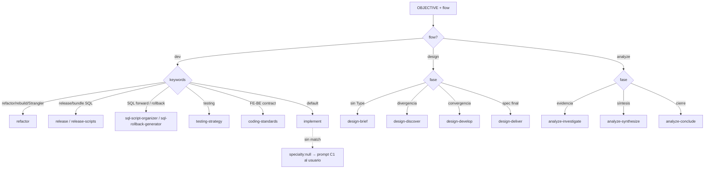
```mermaid
flowchart TD
    obj["OBJECTIVE + flow"] --> sw{"flow?"}
    sw -->|dev| dv{"keywords"}
    dv -->|refactor/rebuild/Strangler| r1["refactor"]
    dv -->|release/bundle SQL| r2["release / release-scripts"]
    dv -->|SQL forward / rollback| r3["sql-script-organizer / sql-rollback-generator"]
    dv -->|testing| r4["testing-strategy"]
    dv -->|FE-BE contract| r5["coding-standards"]
    dv -->|default| r6["implement"]
    sw -->|design| dg{"fase"}
    dg -->|sin Type| g1["design-brief"]
    dg -->|divergencia| g2["design-discover"]
    dg -->|convergencia| g3["design-develop"]
    dg -->|spec final| g4["design-deliver"]
    sw -->|analyze| az{"fase"}
    az -->|evidencia| a1["analyze-investigate"]
    az -->|síntesis| a2["analyze-synthesize"]
    az -->|cierre| a3["analyze-conclude"]
    r6 -.->|sin match| c1["specialty:null → prompt C1 al usuario"]
```

---

## 5. Modelo de artefactos

Los artefactos viven en la carpeta de sesión. El CLI los trata como markdown free-form (no parsea estructura salvo los que tienen reader dedicado). Headers canónicos en **EN**; aliases ES legacy aceptados por parsers bilingües.

| Artefacto | Fase | Flow | Reader CLI | ¿Se gradúa? |
|---|---|---|---|---|
| `OBJECTIVE.md` (legacy `OBJETIVO.md`) | planning | todos | `objetivo-data` | no (raíz de la sesión) |
| `TASKS.md` | planning | todos | `tasks-data` | no |
| `DESIGN.md` | planning (closure) | dev feature/refactor | — | no (puede cerrar sesión sin código) |
| `DECISIONS.md` (legacy `DECISIONES.md`) | execution | todos | `decisiones-list` | sí → `decision` |
| `DEPENDENCIES.md` (legacy `DEPENDENCIAS.md`) | execution | cross-flow | `dependencias-list` | no |
| `scripts/` · `SCRIPTS.sql` · `queries/` | execution | dev / analyze | (vía `release-data` / `export-scripts`) | sí → `script` |
| `EVIDENCE.md` → `FINDINGS.md` → `CONCLUSIONS.md` | execution | analyze | — | `CONCLUSIONS` → `conclusion` (opt-in) |
| `DISCOVERY/PROBLEM/IDEAS/BRIEF.md` · `DELIVERY.md` | execution | design | — | `DELIVERY` → `especificacion` |
| `REFACTOR.md` | execution | dev refactor | — | no (DEC-003) |
| `MANUAL.md` | execution | dev | — | sí → `manual` |
| `BACKLOG.md` | closure | todos | — | **no** (lo consume `export-plan`) |
| `CHECKPOINT.md` | closure / PreCompact | todos | `checkpoint-read` / `checkpoint-write` | no |
| `HISTORY.md` (workspace) | continuo | — | `history-data` / `history-update` | n/a (índice) |

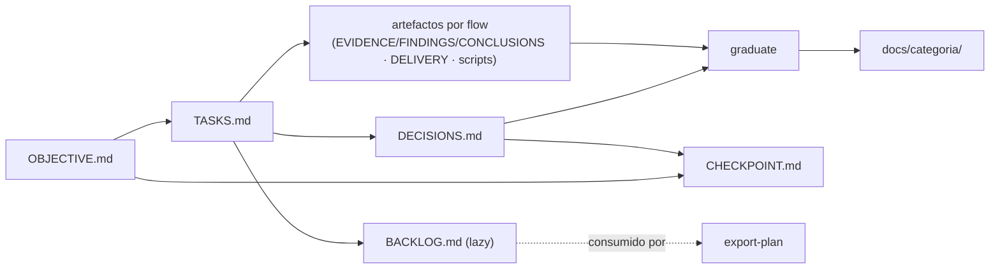
```mermaid
flowchart LR
    obj["OBJECTIVE.md"] --> tasks["TASKS.md"]
    tasks --> dec["DECISIONS.md"]
    tasks --> art["artefactos por flow<br/>(EVIDENCE/FINDINGS/CONCLUSIONS · DELIVERY · scripts)"]
    dec --> grad["graduate"]
    art --> grad
    tasks --> bl["BACKLOG.md (lazy)"]
    obj --> cp["CHECKPOINT.md"]
    dec --> cp
    grad --> docs["docs/categoria/"]
    bl -.->|consumido por| ep["export-plan"]
```

---

## 6. Modelo de graduación

**Graduar** = promover un artefacto de la sesión a una ubicación permanente en `docs/`. Tres mecanismos, por cardinalidad:

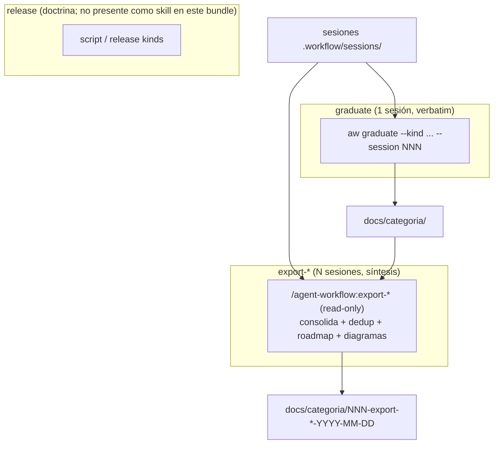
```mermaid
flowchart TB
    subgraph single["graduate (1 sesión, verbatim)"]
      g["aw graduate --kind ... --session NNN"]
    end
    subgraph cross["export-* (N sesiones, síntesis)"]
      e["/agent-workflow:export-* (read-only)<br/>consolida + dedup + roadmap + diagramas"]
    end
    subgraph rel["release (doctrina; no presente como skill en este bundle)"]
      rr["script / release kinds"]
    end
    sess["sesiones .workflow/sessions/"] --> g --> docs["docs/categoria/"]
    sess --> e
    docs --> e
    e --> docs2["docs/categoria/NNN-export-*-YYYY-MM-DD"]
```

### 6.1 Las 6 kinds (DEC-003)

Solo 6 kinds graduan; el resto vive en la sesión. Destino = función pura de `workspace_mode + kind` (sin prompt — DEC-002).

| Kind | Comando | Fuente en sesión | Destino |
|---|---|---|---|
| `decision` | `graduate --kind decision --id DEC-NNN --slug ...` | bloque `## DEC-NNN` de `DECISIONS.md` | `docs/decisiones/NNN-<slug>.md` |
| `manual` | `graduate --kind manual --slug ...` | `MANUAL.md` (o `--source`) | `docs/manuales/NNN-<slug>.md` |
| `script` | doctrina: `/agent-workflow:release`; **código: `graduate --kind script` también funciona** | `scripts/` + `queries/` | `docs/scripts/NNN-sessionXXX-<slug>/` |
| `especificacion` | `graduate --kind especificacion --slug ...` | `DELIVERY.md` (o `--source`) | `docs/especificaciones/NNN-<slug>/` |
| `conclusion` | `graduate --kind conclusion --slug ...` (opt-in) | `CONCLUSIONS.md` | `docs/conclusiones/NNN-<slug>.md` |
| `release` | `/agent-workflow:release` (en código `graduate` lo **rechaza**) | — | `docs/release/NNN-informe-release.md` |

Eliminados del modelo nuevo: `plan`, `refactor`, `design`, `design-system`, `propuesta`, `postmortem`, `analysis`.

### 6.2 Routing hub vs project (DEC-002)

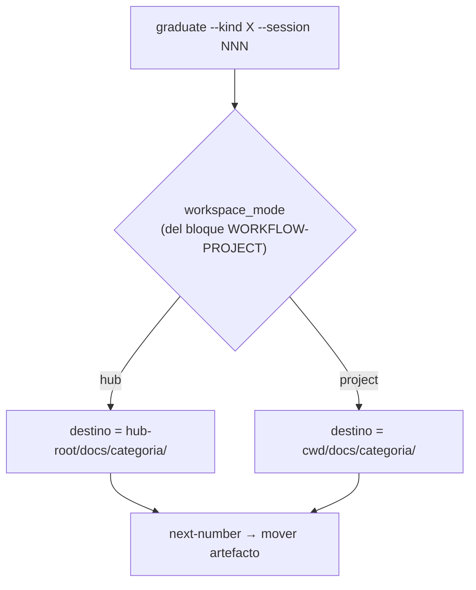
```mermaid
flowchart TD
    k["graduate --kind X --session NNN"] --> m{"workspace_mode<br/>(del bloque WORKFLOW-PROJECT)"}
    m -->|hub| h["destino = hub-root/docs/categoria/"]
    m -->|project| p["destino = cwd/docs/categoria/"]
    h --> num["next-number → mover artefacto"]
    p --> num
```

Sin prompt, sin override, sin breadcrumbs hub↔fuente. El CLI lee `workspace_mode`, resuelve `docs_root`, numera y mueve.

### 6.3 La familia `export-*`

9 slash-commands `/agent-workflow:export-*`. Todos **read-only**: leen N sesiones + el corpus `docs/`, **sintetizan** un documento nuevo numerado, y nunca commitean ni mutan la sesión. Consumen el lifecycle solo vía CLI (`release-data`, `history-data`, `session-artifacts`, `next-number`).

| Skill | Estado | Salida | Default / variantes |
|---|---|---|---|
| `export-report` | activo (v1.7.0) | `docs/funcional/NNN-export-report-YYYY-MM-DD.md` | **B (≤760w)** default; A/B/C vía `--audiencia`×`--mode` |
| `export-arq` | activo (v1.3.0) | `docs/arquitectura/NNN-export-arq-YYYY-MM-DD/` | C4; engine `--diagrams` (⚠️ default discrepa: skill dice structurizr, slash dice mermaid) |
| `export-tech-manuals` | activo (v1.1.0) | `docs/manuales/INDEX.md` o dossier `NNN-...` | `complementar` default (sobrescribe INDEX) / `regenerar` |
| `export-scripts` | activo (v5.0.0) | `docs/scripts/NNN-export-scripts-YYYY-MM-DD/` | bundle con `00-ROLLBACK.sql` + forwards numerados |
| `export-plan` | activo (v1.1.0) | `docs/planes/NNN-<slug>-YYYY-MM-DD.md` | frontmatter `state` draft/active/done/archived |
| `export-conclusions` | activo (v1.1.0) | `docs/conclusiones/NNN-<slug>-YYYY-MM-DD.md` | dedup R-items + roadmap; complementa `graduate --kind conclusion` |
| `export-qa-note` | **STUB** (v0.1.0) | — | diferido (session081) |
| `export-requirement` | **STUB** (v0.1.0) | — | diferido (session081) |
| `export-tech-note` | **STUB** (v0.1.0) | — | diferido (session081) |

### 6.4 Taxonomía `docs/`

| Carpeta | Escrita por | ¿Activa? |
|---|---|---|
| `docs/decisiones/` | `graduate --kind decision` | sí |
| `docs/manuales/` | `graduate --kind manual` + `export-tech-manuals` | sí |
| `docs/scripts/` | `graduate --kind script` + `export-scripts` | sí |
| `docs/especificaciones/` | `graduate --kind especificacion` | sí |
| `docs/conclusiones/` | `graduate --kind conclusion` + `export-conclusions` (contador compartido) | sí |
| `docs/planes/` | `export-plan` | sí |
| `docs/arquitectura/` | `export-arq` | sí |
| `docs/funcional/` | `export-report` (+ stubs qa-note/requirement planeados) | sí (export-report) |
| `docs/release/` | skill `release` (doctrina) | **no** — no hay skill release en este bundle |
| `docs/referencias/` | usuario (manual); AI solo a pedido | n/a — **fuera del flujo de graduación** (DEC-004 v2) |

---

## 7. Modos: project vs hub

El modo se lee del bloque `<NS>-PROJECT`; `hub` requiere el marcador literal `Mode: hub`. Default `project`.

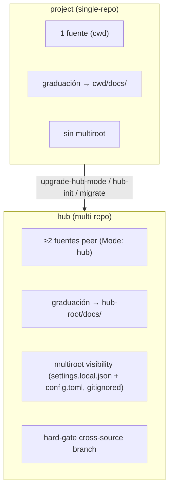
```mermaid
flowchart TB
    subgraph project["project (single-repo)"]
      p1["1 fuente (cwd)"]
      p2["graduación → cwd/docs/"]
      p3["sin multiroot"]
    end
    subgraph hub["hub (multi-repo)"]
      h1["≥2 fuentes peer (Mode: hub)"]
      h2["graduación → hub-root/docs/"]
      h3["multiroot visibility (settings.local.json + config.toml, gitignored)"]
      h4["hard-gate cross-source branch"]
    end
    project -->|upgrade-hub-mode / hub-init / migrate| hub
```

| Diferencia | project | hub |
|---|---|---|
| Fuentes | 1 (cwd), `project-init` | ≥2, `hub-init` (`--fuente` es autoritativo: reemplaza, no merge) |
| Graduación | `cwd/docs/` | `hub-root/docs/` (nunca a fuente) |
| Multiroot visibility | no | **siempre** (Claude `additionalDirectories` en `settings.local.json`; Codex `additional_writable_roots` + `trust_level` en `config.toml`; + Warp/OZ) |
| Branch gate | per-source (`hook branch-check`) | per-source **+ hard-gate cross-source** si `cross_source_consistent=false` |
| `doctor` scope | `--plugin-root cwd` | `--scope all` |

Upgrade idempotente: `aw upgrade-hub-mode [--dry-run]` (también vía `/agent-workflow:migrate --upgrade-hub-mode` o `/agent-workflow:hub-init`). Diagnóstico de drift: `aw visibility doctor` (exit 1 si hay drift).

---

## 8. Hooks

Eventos del host que disparan al CLI (`skills/agent-workflow/hooks/hooks.template.json`). Cada hook lee JSON por stdin; exit `0` = procede/silencioso/warn, exit `2` = bloquea.

| Hook / comando | Evento + matcher | Qué hace | Bloquea? |
|---|---|---|---|
| namespace bootstrap (`sh -c` inline) | `SessionStart` (`startup\|resume\|clear`) | escribe `workflow` en `~/.config/agent-workflow/namespace` | no (exit 0) |
| `aw hook branch-check` | `PreToolUse` (`Edit\|Write\|MultiEdit\|NotebookEdit`) | bloquea edit si la rama actual ≠ esperada para la fuente del archivo | **sí (exit 2)** |
| `aw hook sql-mutation-guard` | `PreToolUse` (`mcp__.*__execute_sql`) | bloquea DML/DDL (INSERT/UPDATE/DELETE/TRUNCATE/MERGE/CREATE/ALTER/DROP/GRANT/REVOKE/COPY) en MCP read-only. Bypass: `AW_SQL_GUARD=off` | **sí (exit 2)** |
| `aw hook git-commit-advisor` | `PreToolUse` (`Bash`) | si hay sesión activa y el `git commit -m` no trae tag `sessionNNN`, avisa por stderr | no (advisory) |
| `aw checkpoint-write` | `PreCompact` | escribe `CHECKPOINT.md` antes de compactar | — |
| `aw resume-summary` + hook `prompt` | `PostCompact` | emite payload de retomar; instruye al AI a invocar `/agent-workflow:resume` | — |
| `aw auto-compact-on-close` | `SessionEnd` | escribe `CHECKPOINT.md` de todas las sesiones activas al cerrar el cliente | — |

> Solo `branch-check` y `sql-mutation-guard` bloquean. `git-commit-advisor` es no-bloqueante por diseño.

---

## 9. Verificación interactiva de ramas

Gate común invocado al crear, retomar y al entrar a execution. `aw sources [--session CODE] [--scope ...]` devuelve por fuente `{match, dirty, current_branch, expected_work_branch, flow}` + `cross_source_consistent`.

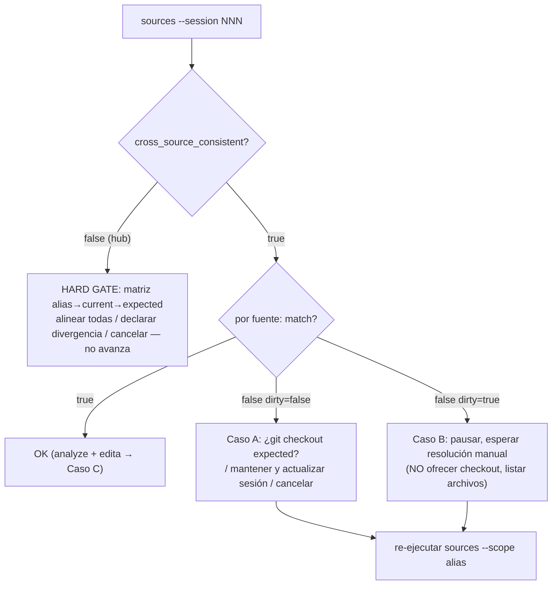
```mermaid
flowchart TD
    s["sources --session NNN"] --> xs{"cross_source_consistent?"}
    xs -->|"false (hub)"| hg["HARD GATE: matriz alias→current→expected<br/>alinear todas / declarar divergencia / cancelar — no avanza"]
    xs -->|true| perf{"por fuente: match?"}
    perf -->|true| ok["OK (analyze + edita → Caso C)"]
    perf -->|false dirty=false| caseA["Caso A: ¿git checkout expected?<br/>/ mantener y actualizar sesión / cancelar"]
    perf -->|false dirty=true| caseB["Caso B: pausar, esperar resolución manual<br/>(NO ofrecer checkout, listar archivos)"]
    caseA --> re["re-ejecutar sources --scope alias"]
    caseB --> re
```

**Reglas absolutas**: nunca `git stash` / `reset --hard` / `checkout -- .` / `restore .` / `clean` sin confirmación explícita por fuente. Tras cualquier acción git, re-ejecutar `sources`.

---

## 10. Una sesión dev end-to-end

Diagrama integrador (sesión `flow=dev`, `Type: feature`, project mode):

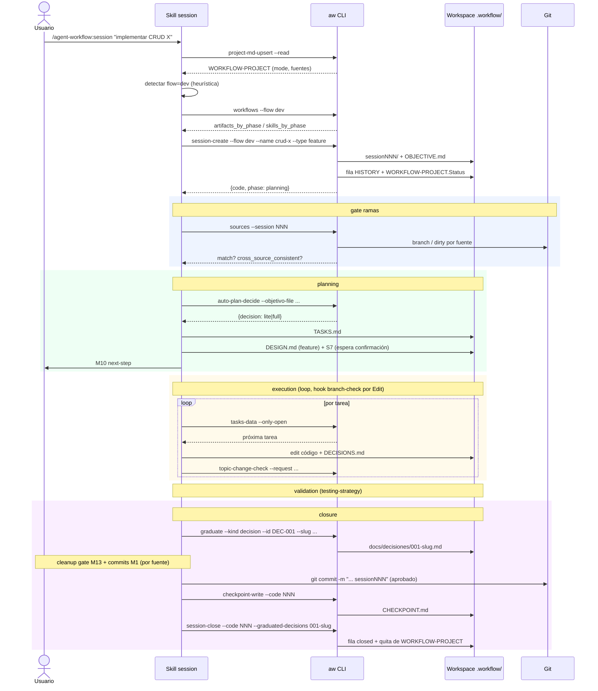
```mermaid
sequenceDiagram
    actor U as Usuario
    participant S as Skill session
    participant CLI as aw CLI
    participant WS as Workspace .workflow/
    participant G as Git

    U->>S: /agent-workflow:session "implementar CRUD X"
    S->>CLI: project-md-upsert --read
    CLI-->>S: WORKFLOW-PROJECT (mode, fuentes)
    S->>S: detectar flow=dev (heurística)
    S->>CLI: workflows --flow dev
    CLI-->>S: artifacts_by_phase / skills_by_phase
    S->>CLI: session-create --flow dev --name crud-x --type feature
    CLI->>WS: sessionNNN/ + OBJECTIVE.md
    CLI->>WS: fila HISTORY + WORKFLOW-PROJECT.Status
    CLI-->>S: {code, phase: planning}

    rect rgb(238,244,255)
    note over S,G: gate ramas
    S->>CLI: sources --session NNN
    CLI->>G: branch / dirty por fuente
    CLI-->>S: match? cross_source_consistent?
    end

    rect rgb(238,255,244)
    note over S,WS: planning
    S->>CLI: auto-plan-decide --objetivo-file ...
    CLI-->>S: {decision: lite|full}
    S->>WS: TASKS.md
    S->>WS: DESIGN.md (feature) + S7 (espera confirmación)
    S->>U: M10 next-step
    end

    rect rgb(255,250,235)
    note over S,WS: execution (loop, hook branch-check por Edit)
    loop por tarea
      S->>CLI: tasks-data --only-open
      CLI-->>S: próxima tarea
      S->>WS: edit código + DECISIONS.md
      S->>CLI: topic-change-check --request ...
    end
    end

    note over S,WS: validation (testing-strategy)

    rect rgb(250,238,255)
    note over S,WS: closure
    S->>CLI: graduate --kind decision --id DEC-001 --slug ...
    CLI->>WS: docs/decisiones/001-slug.md
    note over S,U: cleanup gate M13 + commits M1 (por fuente)
    S->>G: git commit -m "... sessionNNN" (aprobado)
    S->>CLI: checkpoint-write --code NNN
    CLI->>WS: CHECKPOINT.md
    S->>CLI: session-close --code NNN --graduated-decisions 001-slug
    CLI->>WS: fila closed + quita de WORKFLOW-PROJECT
    end
```

---

## 11. Catálogo de comandos del CLI

El CLI registra **48 subcomandos** (en **43 archivos**; algunos archivos exportan varios: `checkpoint-write.ts`→`+auto-compact-on-close`, `multiroot.ts`→`attach/detach`, `dev-only.ts`→`harness/profiles/logs/next-number`). La familia autoritativa está en `src/cli/help-groups.ts` (10 familias nombradas + bucket auto **"Other"**).

**Session lifecycle** · `sessions` (RO), `session-create` (M), `session-resume` (RO), `session-close` (M), `session-artifacts` (RO)

**Objetivo / Tasks** · `objetivo-data` (RO), `tasks-data` (RO), `decisiones-list` (RO), `dependencias-list` (RO)

**Checkpoint** · `checkpoint-read` (RO), `checkpoint-write` (M), `compress-checkpoint` (RO), `auto-compact-on-close` (M)

**Sources / Branches** · `sources` (RO), `attach-multiroot` (M), `detach-multiroot` (M), `check-branch` (RO, exit 2 con `--strict`)

**Orchestration** · `phase-detect` (RO), `phase-next` (M), `workflows` (RO), `workspace-mode` (RO), `stack` (RO), `skill-index` (RO), `auto-plan-decide` (RO), `topic-change-check` (RO), `specialty-choose` (RO), `resume-summary` (RO)

**Doctor / Data** · `plugin-doctor` (RO), `plugin-cache` (M), `history-data` (RO), `history-update` (M), `release-data` (RO), `code-scan` (RO), `project-md-upsert` (M; RO con `--read`), `bootstrap-dsn` (M), `graduate` (M), `upgrade-hub-mode` (M; RO con `--dry-run`)

**Hooks** · `hook` → `branch-check` / `sql-mutation-guard` / `git-commit-advisor` (advisory; bloquean vía exit code, sin escribir fs)

**MCP** · `mcp` → `dbhub` / `setup` / `remove` / `doctor` / `warp-status`

**Dev-only** · `harness` (RO), `profiles` (RO), `logs` (RO; `--clear` M), `next-number` (RO)

**Self** · `self` → `namespace` / `doctor` / `detect-hosts` (RO) · `update` / `install*` / `uninstall*` / `clean-*` / `mcp` / `bootstrap` (M)

**Other** (registrados pero sin familia en help-groups) · `hub-init` (M; RO con `--dry-run`), `graduation-check` (RO, hub), `host-doctor` (RO), `visibility` → `doctor` (RO)

> `(RO)` = read-only · `(M)` = muta estado (fs / project block / docs). Detalle de flags por familia: `skills/agent-workflow/references/<familia>.md`.

---

## 12. Catálogo de slash-commands y doctrina

### 12.1 Slash-commands (`/agent-workflow:*`)

17 comandos canónicos + 3 stubs export (= 18 archivos `.md` con README). Se instalan vía el plugin (`/plugin install`), no con la SKILL.

| Comando | CLI que invoca | Skill/doctrina | Propósito |
|---|---|---|---|
| `session` | `session-create` + sub-flows | doctrine `session` | Entry point único del lifecycle (create/resume/list/close) |
| `resume` | `resume-summary`, `checkpoint-read` | doctrine `resume` | Retomar desde `CHECKPOINT.md` |
| `compact` | `checkpoint-write --force` → `/compact` | doctrine `compact` | Persistir estado + compactar contexto |
| `patch` | `session-create --lite --flow dev` | `session` (lite) | Micro-lifecycle para fixes/chores |
| `project-init` | `project-md-upsert --init --mode project` | doctrine `project-init` | Inicializa WORKFLOW-PROJECT single-repo |
| `hub-init` | `hub-init` + `attach-multiroot` | doctrine `hub-init` | Inicializa hub multi-repo + visibilidad |
| `doctor` | `plugin-doctor` por fuente | doctrine `doctor` | Health-check de plugins agent-workflow-* |
| `migrate` | `upgrade-hub-mode` + lecturas | doctrine `migrate` | Migra legacy → formato actual |
| `rules` | — (read-only) | doctrine `rules` | Bundle de los 8 anchors transversales |
| `export-report` | `history-data`, `session-artifacts`, ... | `export-report` | Informe ejecutivo |
| `export-arq` | `project-md-upsert --read`, ... | `export-arq` | Arquitectura con C4 |
| `export-tech-manuals` | `history-data`, `session-artifacts` | `export-tech-manuals` | Manuales técnicos |
| `export-scripts` | `release-data` | `export-scripts` | Bundle SQL consolidado |
| `export-plan` | `release-data --include-graduated` | `export-plan` | Plan ejecutable con estado |
| `export-conclusions` | `release-data --include-graduated` | `export-conclusions` | Conclusiones curadas |
| `export-qa-note` / `export-requirement` / `export-tech-note` | — | stubs v0.1.0 | **diferidos** |

### 12.2 Doctrina (`skills/agent-workflow/doctrine/<name>/SKILL.md`)

- **session** (v4.4.0) — el cerebro del lifecycle (4 fases, intención, lite, closure).
- **compact** / **resume** — persistencia y recuperación de contexto (CHECKPOINT).
- **doctor** — orquesta `plugin-doctor` por fuente (read-only).
- **hub-init** / **project-init** — inicialización de workspace.
- **migrate** — migración de artefactos legacy (idempotente, nunca borra: archiva).
- **implement** (v2.2.1) — especialidad dev: loop de execution (flat / phased + M6).
- **refactor** (v1.3.1) — especialidad dev: Strangler Fig (M7/M8), produce `REFACTOR.md`.
- **rules** (v0.3.0) — bundle de 8 anchors: commits-policy, sandbox-readonly, mcp-readonly, redaccion-simple, coding-standards, graduacion-routing, branch-verification, closure-cleanup.

### 12.3 Catálogo de prompts (`AskUserQuestion`)

El skill nunca narra preguntas en texto plano; usa specs `AskUserQuestion` versionadas en `doctrine/session/references/prompts/`:

| Serie | Prompts | Cuándo |
|---|---|---|
| **S** (selección) | S1 type-design · S2 topic-change · S3 flow-detection · S4 resume · S5 post-compact · S6 scope · S7 design-review | decisiones de planificación |
| **M** (momentos) | M1 closure-commit · M2 branch-caso-A · M3 branch-caso-C · M4 cross-source-hard-gate · M5 modality-analyze · M6 phase-gate · M7 refactor-legacy · M8 refactor-cleanup · M9 contract-review · M10 next-step · M11 context · M13 closure-cleanup | gates del lifecycle (M12 **eliminado**) |
| **C** (composición) | C1 specialty-selection · C2 cost-guard | composición de especialidades |

---

## 13. Hallazgos: inconsistencias código vs doctrina

Detectadas al cruzar `src/` con `skills/agent-workflow/`. **No bloquean el funcionamiento**, pero la doctrina/descripciones están desactualizadas en estos puntos:

1. **Namespace default**: código `DEFAULT_NAMESPACE = "workflow"` (`namespace-resolver.ts:13`); el root `SKILL.md` y `MANUAL-TECNICO.md §5` dicen `agent-workflow`. Además el orden real pone **workspace-autodetect antes que user-config**, y la autodetección se basa en el directorio `.<ns>/sessions/` (no en el bloque `<NS>-PROJECT` como dice el manual).
2. **`graduate --kind script`**: la doctrina (`graduacion-routing.md`, `sql-script-organizer`) dice que solo `/agent-workflow:release` debe graduar scripts; el código lo **permite directamente**. Además lee la estructura legacy `scripts/`+`queries/`, no el `SCRIPTS.sql` actual que produce el workflow SQL vigente.
3. **`release` / `docs/release/`**: son doctrina-only — **no existe** skill ni slash-command `release` en este bundle (solo el comando CLI `release-data`). `graduate --kind release` se rechaza en código.
4. **`export-arq` default de diagramas**: el frontmatter del SKILL dice `structurizr`; el archivo del slash-command dice `mermaid`.
5. **Nombres de carpetas**: canónicos son `docs/arquitectura/` y `docs/funcional/`; las descripciones del registry de skills dicen `docs/arq/` y `docs/funcionales/` (stale). `exports/README.md` lista carpetas inexistentes (`docs/diagramas/`) y un `export-diagrams` que no existe.
6. **`references/doctor.md`** documenta kinds eliminados (`plan`, `data`, `postmortem`, `design`).
7. **`graduation-check`** escanea categorías legacy (`propuestas`, `post-mortems`, `analisis`, `refactors`) fuera del modelo de 6 kinds — es detección de huérfanos legacy, no del modelo actual.
8. **Conteo "43 subcomandos"**: 43 es el número de **archivos**; el CLI registra **48** nombres.

---

## 14. Glosario y referencias

**Glosario**

- **Harness** — el sistema completo (CLI + SKILL + plugin) que conduce el lifecycle.
- **Namespace** — identificador del dominio; define `.<ns>/` y `<NS>-PROJECT`.
- **Flow** — tipo de trabajo (core/dev/design/analyze); agrupa especialidades.
- **Especialidad** — skill que se compone dentro de un flow (implement, design-deliver, analyze-conclude…).
- **Graduar** — promover un artefacto de sesión a `docs/<categoria>/`.
- **Anchor** — regla transversal canónica cargada por `/agent-workflow:rules`.
- **Hub / Project** — workspace multi-repo (≥2 fuentes) vs single-repo.

**Referencias internas**

- API del CLI por familia: `skills/agent-workflow/references/<familia>.md`.
- Doctrina del lifecycle: `skills/agent-workflow/doctrine/session/SKILL.md` (+ `references/lifecycle-deep.md`, `graduacion-routing.md`, `specialty-decision-tree.md`).
- Workflows por flow: `skills/agent-workflow/workflows/{dev,design,analyze}-workflow/SKILL.md`.
- Manuales previos (reconciliados por este doc): `skills/agent-workflow/MANUAL-TECNICO.md`, `MANUAL-FUNCIONAL.md`.
- Repo / npm: <https://github.com/Tacuchi/agent-workflow-cli> · <https://www.npmjs.com/package/@tacuchi/agent-workflow-cli>
