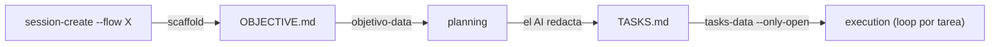

# Guía de artefactos — agent-workflow

> ⚠️ **HISTÓRICO (pre-rediseño).** Describe los artefactos del sistema **viejo** (CLI v11.0.1). El modelo vigente (etapas+loops) tiene su catálogo en `skills/w/artifacts/`; los exports que menciona (p. ej. `export-plan`) ya no existen — la familia vigente es `export-scripts`/`export-manuals`/`export-diagrams`/`export-reports`. Se conserva como registro.

> **Qué es.** Referencia práctica de los artefactos de sesión del harness `@tacuchi/agent-workflow-cli`: su estructura, semántica de campos y ejemplos. Cubre **todos los artefactos de sesión**, agrupados por fase y flow. Complementa el panorama de flujos en [`agent-workflow-flujos.md`](agent-workflow-flujos.md) (§3 lifecycle, §5 modelo de artefactos).
>
> **Fuentes de verdad.** Templates en `src/application/templates/objetivo.ts`; parsers en `src/application/parsers/{objetivo,tasks}.ts`. Verificado contra CLI v11.0.1.

---

## Convenciones generales

- **Ubicación.** Cada artefacto vive en la carpeta de la sesión: `.<namespace>/sessions/sessionNNN-<flow>-<slug>/` (aquí: `.workflow/sessions/...`).
- **Idioma de los nombres.** Los nombres canónicos son en **inglés** (`OBJECTIVE.md`, `TASKS.md`, `DECISIONS.md`…). Los equivalentes en español (`OBJETIVO.md`, `## Requerimiento`, `## Tipo`, `## Modalidad`, `## Criterios de aceptación`) son **aliases legacy** que los parsers bilingües siguen leyendo. Para artefactos nuevos, usar EN.
- **Quién escribe.** El CLI **scaffoldea `OBJECTIVE.md`** al crear la sesión (`session-create`); el resto lo escribe el AI / el usuario. El CLI **nunca edita** artefactos por vos — solo los lee.
- **Prosa.** Cuerpo en el idioma del usuario; cabeceras (`## ...`) en EN canon. Seguir `agent-workflow:redaccion-simple` (frases cortas, listas, sin jerga).



---

## Mapa de artefactos

Vista al vuelo de todos los artefactos de sesión (detalle en las secciones siguientes):

| Artefacto | Fase | Flow | Reader CLI | ¿Gradúa? |
|---|---|---|---|---|
| `OBJECTIVE.md` | planning | todos | `objetivo-data` | no |
| `TASKS.md` | planning | todos | `tasks-data` | no |
| `DESIGN.md` | planning (cierre) | dev (feature/refactor) | — | no |
| `DECISIONS.md` | execution | todos | `decisiones-list` | → `decision` |
| `DEPENDENCIES.md` | execution | todos | `dependencias-list` | no |
| `EVIDENCE.md` → `FINDINGS.md` → `CONCLUSIONS.md` | execution | analyze | — | `CONCLUSIONS` → `conclusion` (opt-in) |
| `BRIEF/DISCOVERY/PROBLEM/IDEAS.md` → `DELIVERY.md` | execution | design | — | `DELIVERY` → `especificacion` |
| `REFACTOR.md` | execution | dev (refactor) | — | no |
| `MANUAL.md` | execution | dev | — | → `manual` |
| `SCRIPTS.sql` · `scripts/` · `queries/` | execution | dev / analyze | (`release-data`) | → `script` |
| `BACKLOG.md` | closure (lazy) | todos | — | no (lo lee `export-plan`) |
| `CHECKPOINT.md` | closure / PreCompact | todos | `checkpoint-read` | no |
| `HISTORY.md` *(workspace)* | continuo | — | `history-data` | n/a (índice) |

---

## OBJECTIVE.md

**Propósito.** El acuerdo de qué se va a hacer: el "qué" + contexto + criterios de aceptación. Es la raíz persistente de la sesión (sobrevive a `/compact`).
**Reader CLI.** `agent-workflow objetivo-data --code sessionNNN`.

### Estructura por flow (en orden)

`getObjetivoTemplate(flow, lite)` elige el template. El título siempre es `# Objective — sessionNNN-<flow>-<slug>`; `## Origin` solo aparece en handoffs (`--from <flow>:NNN`). Las secciones *(opc.)* pueden ir vacías. Los criterios son checkboxes `- [ ]`. Headers EN canon (aliases ES legacy aceptados).

**dev**

| # | Sección | Contenido |
|---|---|---|
| 1 | `## Origin` *(opc.)* | handoff de otra sesión |
| 2 | `## Type` | `feature` · `refactor` · `bugfix` · `chore` |
| 3 | `## Requirement` | el qué a construir |
| 4 | `## Context` *(opc.)* | módulos afectados, restricciones |
| 5 | `## Acceptance criteria` | checklist `- [ ]` |
| 6 | `## Topics` *(opc.)* | slug-kebab para `/release-scripts` |

> `feature`/`refactor` → flujo *phased* + gate DESIGN.md/S7; `bugfix`/`chore` → flat.

**design**

| # | Sección | Contenido |
|---|---|---|
| 1 | `## Origin` *(opc.)* | handoff |
| 2 | `## Type` | `project` · `system` |
| 3 | `## Brief` | el qué a diseñar |
| 4 | `## Context` *(opc.)* | usuarios, design system, refs |
| 5 | `## Acceptance criteria` | checklist `- [ ]` |

> `Type` es metadato; ambos gradúan a `docs/especificaciones/` (no afecta el destino).

**analyze**

| # | Sección | Contenido |
|---|---|---|
| 1 | `## Origin` *(opc.)* | handoff |
| 2 | `## Modality` | `technical` · `data` · `incident` |
| 3 | `## Question` | la pregunta a responder |
| 4 | `## Context` *(opc.)* | sistemas/fuentes, stakeholders |
| 5 | `## Success criteria` | checklist `- [ ]` |

> `Modality` modula el cuerpo de CONCLUSIONS: propuesta / informe / post-mortem.

**core / default**

| # | Sección | Contenido |
|---|---|---|
| 1 | `## Origin` *(opc.)* | handoff |
| 2 | `## Requirement` | el qué |
| 3 | `## Context` *(opc.)* | motivación, restricciones |
| 4 | `## Acceptance criteria` | checklist `- [ ]` |

**dev `--lite` (`/patch`)** — mínimo:

| # | Sección | Contenido |
|---|---|---|
| 1 | `## Type` | default `bugfix` (rechaza `feature`/`refactor`) |
| 2 | `## Requirement` | el qué (única "tarea") |

### Qué extrae `objetivo-data`

`{ titulo, tipo, modalidad, brief, criterios_aceptacion[], fuentes_mencionadas[], origen }` — lectura bilingüe EN/ES. `fuentes_mencionadas` se infiere de tokens entre backticks (`` `core` ``) o `fuente:/repo:/source:`.

### Ejemplo (flow=dev)

```markdown
# Objective — session042-dev-fix-login-loop

## Type
bugfix

## Requirement
Resolver el redirect loop tras login en producción: el usuario queda rebotando entre /login y /home.

## Context
- Afecta solo a sesiones con cookie `sid` expirada.
- No cambiar el contrato del endpoint /auth/session.

## Acceptance criteria
- [ ] Login con cookie expirada redirige a /home una sola vez.
- [ ] Test de regresión que reproduce el loop.

## Topics
<!-- Opcional. slug-kebab: descripción corta, usado por /release-scripts. -->
```

### Ejemplo (flow=analyze)

```markdown
# Objective — session055-analyze-latencia-checkout

## Modality
data

## Question
¿Qué etapa del checkout concentra la latencia p95 y cuánto aporta cada una?

## Context
- Fuentes: `api-checkout`, `gateway-pagos`.
- Ventana: últimos 30 días en certificación.

## Success criteria
- [ ] Desglose de latencia p95 por etapa con % de aporte.
- [ ] Recomendación accionable priorizada.
```

---

## TASKS.md

**Propósito.** El plan accionable derivado del OBJECTIVE. Lo escribe el AI en *planning* (manual o vía Plan subagent). No lo scaffoldea el CLI.
**Reader CLI.** `agent-workflow tasks-data --code sessionNNN [--only-open]` → counts (`total/open/closed/progress_pct`), `items[]`, `next_open` y, si hay fases, los grupos.

### Formato

El parser (`parsers/tasks.ts`) es minimalista — solo le importan las **líneas con checkbox**:

- **Tarea:** `- [ ]` (abierta) · `- [x]` (cerrada). También vale `* [ ]`. Debe haber texto después del checkbox.
- **Dependencias (opcional):** sufijo `(deps: X, Y)` en la línea; el parser lo extrae y lo quita del texto visible.
- **Numeración:** el parser numera secuencial (`n`). Los ids tipo `T1.1` son **convención** dentro del texto, no obligatorios.
- **Fases (opcional):** secciones `## Phase N — Título` agrupan tareas. Las usa el flujo **dev phased** (`Type: feature|refactor`) y `tasks-data` las expone como grupos. Sin fases → modo plano (flat).
- Todo lo que no matchee un checkbox (encabezados, prosa, comentarios) se ignora a efectos de conteo.

### Ejemplo (plano)

```markdown
# Tasks — session042-dev-fix-login-loop

- [x] Reproducir el loop con cookie expirada y aislar la causa raíz.
- [ ] Corregir la condición de redirect en el guard de sesión.
- [ ] Agregar test de regresión (deps: 2).
```

`tasks-data` sobre esto → `{ total: 3, open: 2, closed: 1, progress_pct: 33, next_open: "Corregir la condición…" }`.

### Ejemplo (phased — dev feature/refactor)

```markdown
# Tasks — session050-dev-crud-categorias

## Phase 0 — Mapeo + Contrato
- [ ] Stub de endpoints + DTOs devolviendo mocks; routing FE↔BE e2e navegable.

## Phase 1 — Lecturas
- [ ] Listado, combos y filtros con datos reales (deps: Phase 0).

## Phase 2 — Escritura
- [ ] create / update / delete funcionales (sin Bean Validation aún).

## Phase 3 — Validaciones
- [ ] Bean Validation + handler 400 estructurado + reglas de negocio.
```

> En phased, `implement` recorre las fases y dispara el gate **M6** entre cada par. Phase 4 (Seguridad) y Phase 5 (Optimizaciones) se saltan en silencio si están vacías.

---

## Artefactos transversales

Aparecen en cualquier flow.

### DECISIONS.md
*Fase* execution · *Reader* `decisiones-list` · *Gradúa* → `decision`

Registro de decisiones no obvias. Un bloque `## DEC-NNN` por decisión:

```markdown
## DEC-001: PATCH en vez de PUT para edición parcial
Decisión: el endpoint de edición usa PATCH con DTO sparse.
Por qué: evita pisar campos no enviados; alinea con la regla FE-BE.
Alternativas: PUT full (descartado: obliga a mandar toda la entidad).
```

> Al graduar, la 1ª línea del bloque se reemplaza por un puntero `→ docs/decisiones/NNN-slug.md`; `decisiones-list` lo marca `graduated: true`.

### DEPENDENCIES.md
*Fase* execution (opcional) · *Reader* `dependencias-list` · *No se gradúa*

Dependencias cross-sesión / cross-fuente, como **tabla markdown** (o lista con viñetas como fallback):

```markdown
# Dependencies — sessionNNN-dev-<slug>

| depende_de | tipo | estado |
|---|---|---|
| session040 | handoff | cerrada |
| api-pagos v2 | externa | pendiente |
```

### CHECKPOINT.md
*Fase* closure / hook PreCompact · *Writer* `checkpoint-write` · *Reader* `checkpoint-read` · *No se gradúa*

Estado para retomar tras `/compact`. Lo **scaffoldea el CLI** con placeholders `_[AI: …]_` que el modelo completa. Secciones, en orden:

`# Checkpoint — <folder>` (con `Updated`, `Current phase X/4`, `Progress %`) → `## Last action` → `## Next step` → `## Recent decisions` → `## Files touched (post-last-commit)` → `## Critical context to resume` → `## Refs`.

### BACKLOG.md
*Fase* closure (lazy) · *Sin reader* · *No se gradúa* · lo consume `export-plan`

Lo que queda para otras sesiones. Solo se crea si hay valor (≥1 item con razón); sin frontmatter. Secciones:

`## Deferred` (items `D1…` con razón) → `## Discarded` (`X1…` con razón) → `## Followups` (`F1…` con sesión sugerida + dependencia) → `## Notas`.

> No duplicar `CHECKPOINT.md`: CHECKPOINT = retomar *esta* sesión; BACKLOG = pendiente *para otras*.

---

## Artefactos por flow

### dev

| Artefacto | Cuándo | Gradúa | Secciones / forma |
|---|---|---|---|
| **DESIGN.md** | planning closure (`Type: feature\|refactor`) | no¹ | `Context` → `Goals` → `Non-goals` → `Current state` → `Target state` → `New interfaces` → `Wiring` → `Design decisions` (DD-N) → `Open questions` (oblig.; `None` si vacía) |
| **REFACTOR.md** | execution (`Type: refactor`) | no¹ | `Análisis legacy` (paths/endpoints/DTOs/smells) → `Diseño nuevo` → `Plan de migración` (12 pasos Strangler) → `Estado` (yaml) |
| **MANUAL.md** | execution | → `manual` | markdown libre (operación / cómo-funciona) |

¹ Sin kind dedicado (DEC-003); si ameritan preservarse se curan a mano como `manual` o `especificacion`.

### analyze — cadena `EVIDENCE → FINDINGS → CONCLUSIONS`

| Artefacto | Rol | Gradúa | Secciones |
|---|---|---|---|
| **EVIDENCE.md** (+ `queries/`) | recolectar, sin juzgar | no | `Original question` → `Sources consulted` → `Raw finding N` → `Notes / hypotheses` |
| **FINDINGS.md** | sintetizar | no | `Patterns identified` → `False positives discarded` → `Model decision` → `What is NOT known (gaps)` |
| **CONCLUSIONS.md** | concluir + recomendar | → `conclusion` (opt-in) | `Modality` → `Summary` → `Conclusions` (C-N + evidencia) → `Recommendations` (R-N + responsable + cuándo) → `Traceability` → `Open` (opc.) |

> El cuerpo de CONCLUSIONS se modula por `## Modality`: **technical** (propuesta con opciones + decisión), **incident** (timeline + causa raíz + preventivas), **data** (métricas + metodología).

### design — Double Diamond → `DELIVERY`

| Artefacto | Fase | Gradúa | Forma |
|---|---|---|---|
| **BRIEF.md** | planning | no | contexto y restricciones del diseño |
| **DISCOVERY / PROBLEM / IDEAS.md** | execution | no | exploración → problema → propuestas (intermedios) |
| **DELIVERY.md** | execution (cierre) | → `especificacion` | `Summary` → `Components` (type/states/validations/tokens) → `Flows / interactions` → `UX decisions` → `Tokens applied` → `Validation criteria` → `Out of scope` |

---

## Referencias

- Panorama de flujos y lifecycle: [`agent-workflow-flujos.md`](agent-workflow-flujos.md).
- API de los readers: `skills/agent-workflow/references/objetivo-tasks.md` (objetivo/tasks/decisiones/dependencias) + `references/checkpoint.md`.
- Doctrina de planning (auto-plan, DESIGN/S7, phased): `skills/agent-workflow/doctrine/session/SKILL.md` + `workflows/dev-workflow/SKILL.md`.
- Plantillas/specialties por artefacto: `doctrine/implement/references/design-md-template.md` (DESIGN), `doctrine/session/references/backlog-template.md` (BACKLOG), `doctrine/refactor/references/refactor-md-template.md` (REFACTOR), `specialties/analyze-{investigate,synthesize,conclude}/SKILL.md` (EVIDENCE/FINDINGS/CONCLUSIONS), `specialties/design-deliver/SKILL.md` (DELIVERY).
- Templates / parsers del CLI: `src/application/templates/objetivo.ts`, `src/application/parsers/{objetivo,tasks,decisiones,dependencias}.ts`, `src/application/checkpoint/markdown.ts`.
