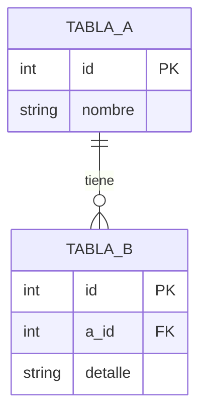

# Plantilla canónica — arquitectura.md (export-arq)

Plantilla con placeholders identificables. Las llaves dobles `{{PLACEHOLDER}}` se reemplazan por el render del skill. Los comentarios `<!-- ... -->` orientan al AI sobre contenido por sección; no aparecen en el output final.

**Secciones condicionales**: aparecen o se omiten según `--scope` y disponibilidad de MCP. Ver `validations.md` V3/V4.

---

```markdown
# Arquitectura — {{PRODUCTO}}

Snapshot del sistema al {{FECHA_SNAPSHOT}}.
Fuentes incluidas: {{LISTA_FUENTES}}.
Variante de diagrama: {{DIAGRAMS_ENGINE}}.

## Resumen

<!-- 2-4 frases. Qué es el sistema, qué hace, en qué consta a alto nivel.
     Audiencia: devs/arquitectos. Sin jerga inventada sin glosa.
     Sin commits, sin nombres de archivos internos. -->

{{RESUMEN}}

## Sistema (C4 Context)

<!-- C4 Level 1: el sistema como caja única + usuarios + sistemas vecinos.
     Default Structurizr DSL (ver workspace.dsl); Mermaid auxiliar embebido para lectura offline.
     Con --diagrams mermaid el bloque queda como Mermaid C4Context nativo.
     Con --diagrams plantuml se reemplaza por nota inline a arquitectura.puml.
     v1.2 (session078): cada bloque Mermaid lleva debajo blockquote con link mermaid.ink/img/<base64>. -->

```mermaid
{{C4_CONTEXT_MERMAID}}
```

> Ver diagrama renderizado: <{{C4_CONTEXT_MERMAID_RENDER_LINK}}>

{{C4_CONTEXT_TEXTO}}

## Contenedores (C4 Container)

<!-- C4 Level 2: aplicaciones / servicios / data stores que componen el sistema.
     Cada fuente declarada en AW-PROJECT aparece como un contenedor.
     Tecnologías por contenedor identificables por manifests (package.json, etc.).
     Default Structurizr DSL (vista `container` en workspace.dsl); Mermaid auxiliar embebido.
     v1.2 (session078): cada bloque Mermaid lleva debajo blockquote con link mermaid.ink/img/<base64>. -->

```mermaid
{{C4_CONTAINER_MERMAID}}
```

> Ver diagrama renderizado: <{{C4_CONTAINER_MERMAID_RENDER_LINK}}>

{{C4_CONTAINER_TEXTO}}

## Componentes (C4 Component)

<!-- C4 Level 3: módulos internos relevantes por contenedor.
     Sólo para los contenedores con suficiente complejidad interna.
     1 diagrama por contenedor relevante; el resto se omite.
     Default Structurizr DSL (vistas `component` por contenedor en workspace.dsl); Mermaid auxiliar embebido.
     Condicional por scope: aparece si --scope ∈ {c4, todo}. -->

{{C4_COMPONENT_BLOQUES}}

## Integraciones externas

<!-- Sistemas externos con los que el workspace interactúa.
     Para agent-workflow runtime hub: MCP servers, hooks PreToolUse, marketplace, npm registry.
     Tabla + opcional sequenceDiagram para flows críticos.
     Condicional por scope: aparece si --scope ∈ {integraciones, todo}. -->

| Integración | Dirección | Tecnología | Uso |
|---|---|---|---|
{{INTEGRACIONES_TABLA}}

{{INTEGRACIONES_DIAGRAMA_OPCIONAL}}

## Modelo de datos

<!-- Esquemas BD relevantes, vía MCP read-only (`\d`, `SELECT count`).
     erDiagram con tablas + FK relevantes.
     Condicional por scope+MCP: aparece si --scope ∈ {datos, todo} Y MCP disponible.
     Si MCP no disponible: nota inline _(MCP no configurado — modelo de datos no disponible)_. -->

{{MODELO_DATOS_OR_OMIT}}

## Decisiones arquitectónicas

<!-- Tabla cronológica de DEC-NNN del corpus + propuestas graduadas.
     Cada decisión linkea a su sesión origen.
     Condicional por scope: aparece si --scope ∈ {decisiones, todo}.
     Si 0 DEC → sección omitida con nota o nada (decisión del render). -->

| Fecha | DEC | Decisión | Origen |
|---|---|---|---|
{{DECISIONES_TABLA}}

## Riesgos y deuda

<!-- Bullets categorizados (negocio / operativo / técnico).
     Extraídos de `## Open (gaps)`, `## Recommendations`, menciones a "deuda" / "riesgo" en el corpus.
     Cada item ≤30 palabras.
     Condicional por scope: aparece si --scope ∈ {riesgos, todo}. -->

{{RIESGOS_BULLETS}}

## Referencias

<!-- Links a artefactos del workspace.
     Hasta 8 referencias. Omitir categorías sin material. -->

{{REFERENCIAS}}
```

---

## Placeholders detallados

### `{{PRODUCTO}}`

Nombre del sistema/producto desde `AW-PROJECT.proyecto`. Si la descripción es larga, usar la primera frase (≤10 palabras). Capitalización natural (no mayúsculas a la fuerza).

Ejemplo: `Runtime agent-workflow` o `Sistema de mantenimiento de parámetros`.

### `{{FECHA_SNAPSHOT}}`

Fecha del sistema al momento de generar el doc. Formato natural ES: `18 de mayo de 2026`.

### `{{LISTA_FUENTES}}`

Lista coma-separada de los alias de fuentes declaradas en AW-PROJECT. Si `--source <alias>`, sólo esa fuente.

Ejemplo: `agent-workflow, agent-workflow, qtc-plugins-marketplace`.

### `{{DIAGRAMS_ENGINE}}`

Valor del flag `--diagrams` resuelto: `Structurizr DSL (default)` / `Mermaid C4 nativo` / `PlantUML (C4-stdlib)`. v1.1 (session077) invirtió el default: la elección refleja la regla "tipo de documento manda" — `export-arq` genera dossiers técnicos, Structurizr es el estándar C4 formal.

### `{{RESUMEN}}` (2-4 frases)

Descripción del sistema en términos técnicos. Sin marketing, sin tono ejecutivo. Audiencia: devs.

### `{{C4_CONTEXT_MERMAID}}`

Bloque Mermaid `C4Context`. Ejemplo de estructura:

```
C4Context
  title Diagrama de Contexto: Runtime agent-workflow
  Person(dev, "Developer", "Miembro del equipo")
  System(sistema, "Runtime agent-workflow", "Coordinación de sesiones")
  System_Ext(claude, "Claude Code", "Host AI")
  System_Ext(codex, "Codex", "Host AI alternativo")
  System_Ext(npm, "npm registry", "Distribución CLI")
  Rel(dev, sistema, "Usa")
  Rel(sistema, claude, "Se integra con")
  Rel(sistema, codex, "Se integra con")
  Rel(sistema, npm, "Publica a")
```

**Default `--diagrams structurizr`**: este bloque contiene el export Mermaid del DSL (auxiliar embebido para lectura offline); el archivo canónico es `workspace.dsl`. Con `--diagrams mermaid`: el bloque es Mermaid C4 nativo y `workspace.dsl` no se genera. Con `--diagrams plantuml`: se reemplaza por nota inline `> Ver arquitectura.puml para el diagrama C4 Context en PlantUML.`

### `{{C4_CONTEXT_TEXTO}}`

1-2 párrafos describiendo el contexto. Quiénes son los actores, qué interacciones existen, qué quedó fuera de scope.

### `{{C4_CONTAINER_MERMAID}}`

Bloque Mermaid `C4Container` con un contenedor por fuente. Ejemplo:

```
C4Container
  title Diagrama de Contenedores: Runtime agent-workflow
  Person(dev, "Developer")
  System_Boundary(sistema, "Runtime agent-workflow") {
    Container(cli, "agent-workflow CLI", "Node.js / TypeScript", "Línea de comandos del runtime")
    Container(plugin, "agent-workflow", "Markdown skills + hooks", "Skills y comandos invocables")
    Container(marketplace, "qtc-plugins-marketplace", "JSON manifest", "Distribución del plugin")
  }
  Rel(dev, cli, "Ejecuta")
  Rel(cli, plugin, "Lee skills")
  Rel(plugin, marketplace, "Distribuido via")
```

### `{{C4_CONTAINER_TEXTO}}`

1 párrafo por contenedor: responsabilidad + tecnología + dependencias externas relevantes.

### `{{C4_COMPONENT_BLOQUES}}`

Para cada contenedor con complejidad interna suficiente: header `### <Contenedor>` + Mermaid C4Component + texto descriptivo.

Si ningún contenedor justifica C4 Component → omitir esta sub-sección completa con nota inline `_(No se identificaron contenedores con complejidad interna que justifiquen C4 Component nivel.)_`.

### `{{INTEGRACIONES_TABLA}}`

Filas por integración:

| Integración | Dirección | Tecnología | Uso |
|---|---|---|---|
| Claude Code | bidireccional | CLI + hooks JSON | Host AI principal |
| Codex | bidireccional | CLI + hooks JSON | Host AI alternativo |
| MCP <mcp-cert> | salida read-only | PostgreSQL via MCP | Consulta de esquemas BD |
| npm registry | salida write | HTTPS | Distribución CLI |

### `{{INTEGRACIONES_DIAGRAMA_OPCIONAL}}`

Sequence Mermaid opcional para flows críticos (ej. session-create cross-runtime). Sólo si aporta claridad real.

### `{{MODELO_DATOS_OR_OMIT}}`

**A. Si MCP disponible Y `--scope` ∈ {datos, todo}**:



+ tabla con tamaños (cantidad de filas por tabla relevante).

**B. Si MCP NO disponible o `--scope` excluye datos**:

```
_(MCP no configurado en este workspace — modelo de datos no disponible.
Esta sección aparece en workspaces de producto con MCP <mcp-cert> / <mcp-prod> habilitado.)_
```

Encabezado de sección sigue presente; el body es la nota.

### `{{DECISIONES_TABLA}}`

Filas cronológicas (más reciente primero):

| Fecha | DEC | Decisión | Origen |
|---|---|---|---|
| 2026-05-18 | DEC-001 | Skill standalone sin foundation export-shared | session057-dev-export-func |
| 2026-05-18 | DEC-002 | Skill orquesta, sin sub-comando CLI dedicado | session057-dev-export-func |
| ... | ... | ... | ... |

Si 0 DEC en el corpus filtrado por `--since` → omitir la sección completa o reemplazar por nota `_(Sin decisiones formales DEC-NNN registradas en el período filtrado.)_` (decisión del render según contexto).

### `{{RIESGOS_BULLETS}}`

Bullets categorizados:

```
**De negocio**:
- ...

**Operativos**:
- ...

**Técnicos**:
- ...
```

Omitir sub-categorías vacías. Cada item ≤30 palabras.

### `{{REFERENCIAS}}`

Bullets agrupados:

```
- Decisiones documentadas: docs/decisiones/
- Propuestas técnicas: docs/conclusiones/
- Especificaciones: docs/especificaciones/
- Manuales operativos: docs/manuales/
- Informes ejecutivos: docs/funcional/
- Scripts SQL: docs/scripts/
- README del workspace: ./README.md (si existe)
```

V6 valida que cada path resoluble exista en filesystem; los que no existen → omitidos.

## Reglas de render

1. **Sin cota dura de palabras**: este doc es técnico; completitud > concisión.
2. **Léxico**: aplica `lexico-tecnico.md` (mínimo — sólo vetar noise/jerga inventada/placeholders sin reemplazar). NO traducción ejecutiva.
3. **Diagrama central**: el documento sin diagramas C4 (al menos Context+Container) no es válido — V1 hard-fail.
4. **Modelo de datos**: condicional V4. Si MCP no configurado → nota inline, no placeholder vacío.
5. **Decisiones**: condicional. Si 0 DEC → nota o sección omitida (consistente con el patrón).
6. **Link mermaid.ink por bloque Mermaid (v1.2 — session078)**: cada bloque ```` ```mermaid ```` lleva blockquote inline debajo: `> Ver diagrama renderizado: <https://mermaid.ink/img/BASE64>`. Encoding plain base64 URL-safe del código Mermaid plano. NO aplica a workspace.dsl ni arquitectura.puml.
7. **Idempotencia conceptual**: dos generaciones consecutivas sobre el mismo workspace producen documentos equivalentes en estructura y datos (diagramas pueden tener layout distintos por nature del render; el BASE64 del link cambia solo si cambia el código Mermaid).
