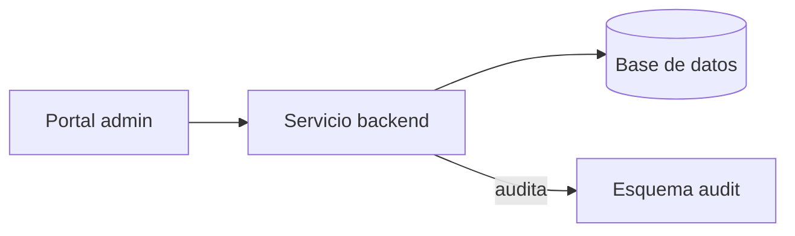

# Plantilla Variante B — Informe ejecutivo (default · 760w)

Plantilla canónica del informe ejecutivo para audiencia gerencia + jefatura. Cota dura **760 palabras (±10%; hard fail ±20%)** (v1.1: subió de 700w a 760w para acomodar Componentes impactados). 10 secciones obligatorias en orden fijo (8 hasta v1.0). "Oportunidades de mejora" condicional (ver V4 en `validations.md`).

Las llaves dobles `{{PLACEHOLDER}}` se reemplazan por el render del skill. Los comentarios `<!-- ... -->` orientan al AI sobre peso, forma y prohibiciones; no aparecen en el output final.

---

```markdown
{{PRODUCTO}} — Informe ejecutivo
Período: Del {{FECHA_INICIO}} al {{FECHA_FIN}}. {{N_SESIONES}} sesiones trabajadas.

# Resumen ejecutivo

<!-- 80 palabras (±15%). Prosa. 1 párrafo.
     Estructura sugerida: estado actual + qué se hizo + por qué importa.
     Prohibido: acrónimos sin glosar, nombres internos de skills/comandos/archivos. -->

{{RESUMEN}}

# Período cubierto

<!-- 20 palabras. 1 línea. Formato exacto:
     "Del DD de mes al DD de mes de YYYY. N sesiones trabajadas." -->

{{PERIODO}}

# Objetivo

<!-- 120 palabras (±15%). Prosa breve. 2-4 objetivos mayores, un párrafo corto
     por cada uno (30-50 palabras). Cada objetivo declara el "para qué" en
     términos de negocio. Sin solapamiento.
     v1.1 (session076): renombrada desde "Finalidades" y reubicada antes de Logros. -->

{{OBJETIVO}}

# Logros del período

<!-- 200 palabras (±15%). Bullets agrupados por capacidad de negocio (NO por sesión).
     4-8 bullets. Cada bullet ≤25 palabras, empezando con verbo en participio/gerundio
     del estado terminado ("Reglas comunes ahora se aplican...", "Compatibilidad
     incorporada con...", "Migración completada..."). Sin nombres internos. -->

{{LOGROS}}

# Componentes impactados

<!-- 60 palabras (±20%; tabla — pesa menos por palabra). Tabla markdown con 3 columnas:
     | Componente | Tipo | Estado |
     - Componente: nombre legible de la fuente / repo / módulo / esquema+tabla.
     - Tipo: "BackEnd" | "FrontEnd" | "Base de datos" (escrito así, en español; nada de "BE"/"FE"/"DB" técnicos).
     - Estado: "Completo" | "Cambios pendientes".
     3-7 filas. Una fila por componente impactado en el período.
     v1.1 (session076): sección nueva. Sourcing en SKILL.md §Paso 4. -->

{{COMPONENTES_IMPACTADOS}}

# Diagrama de flujo

<!-- 0 palabras contadas (code-fenced; exento de V1).
     v1.2 (session077): Mermaid `flowchart LR` por default (3-6 nodos típicos);
     audiencia ejecutiva consume mejor el render visual del viewer Markdown.
     ASCII (arrows ↔ → ←, boxes [Nombre]) permanece como fallback opt-in
     cuando Mermaid no aporta claridad (flujos triviales 1-2 nodos).
     Máx ~15 líneas dentro del code fence.
     Mostrar la conexión/integración entre los componentes listados arriba.
     v1.1 (session076): sección agregada. Sourcing en SKILL.md §Paso 4. -->

{{DIAGRAMA_FLUJO}}

# Alcances / Límites

<!-- 120 palabras (±15%). Dos sub-bloques explícitos:
     "Cubre:" (3-5 bullets cortos) y "No cubre:" (3-5 bullets cortos).
     "No cubre" gestiona expectativas; sin tono defensivo. -->

Cubre:
{{ALCANCES}}

No cubre:
{{LIMITES}}

# Riesgos y deuda

<!-- 80 palabras (±15%). Bullets. 3-5 items cortos (≤20 palabras cada uno).
     Mezcla riesgos abiertos y deuda funcional reconocida.
     No mencionar responsable acá (eso va en Oportunidades de mejora). -->

{{RIESGOS}}

{{OPORTUNIDADES_OR_OMIT}}

# Referencias

<!-- Resto del documento. Bullets con links a docs/<categoria>/.
     Hasta 6 referencias. Agrupar por categoría.
     Si una categoría no tiene material, omitir el grupo.
     Sin links externos (JIRA, GitHub PRs). -->

{{REFERENCIAS}}
```

---

## Placeholders detallados

### `{{PRODUCTO}}`

Nombre del sistema/producto en mayúscula inicial. Se obtiene del bloque `AW-PROJECT.proyecto` del workspace (lectura via `project-md-upsert --read`). Si la descripción es larga, usar la primera frase (≤8 palabras).

Ejemplos válidos:
- `RUNTIME QTC-*`
- `Sistema de Mantenimiento de Parámetros`
- `Portal de Solicitudes`

### `{{FECHA_INICIO}}` / `{{FECHA_FIN}}`

Formato natural en español: `8 de mayo`, `21 de septiembre`. Calculadas a partir del filtro `--period` o del rango efectivo del corpus filtrado.

### `{{N_SESIONES}}`

Count de sesiones del corpus filtrado. Sólo número, sin formato extra.

### `{{RESUMEN}}` (80w)

1 párrafo. Estado actual del sistema + qué se hizo en el período + por qué importa. Lenguaje ejecutivo. Sin acrónimos sin glosar.

### `{{PERIODO}}` (20w)

Re-statement del rango temporal en formato fijo: `Del <DD> de <mes> al <DD> de <mes> de <YYYY>. <N> sesiones trabajadas.`

### `{{OBJETIVO}}` (120w) — v1.1

2-4 objetivos mayores, un párrafo corto por cada uno (30-50w). Cada objetivo declara qué problema de negocio resuelve. Sin solapamiento. Renombrado desde `{{FINALIDADES}}` en v1.1 y reubicado antes de Logros para enmarcar la lectura.

### `{{LOGROS}}` (200w)

4-8 bullets agrupados por capacidad de negocio. Cada bullet:
- Empieza con verbo en estado terminado ("Reglas comunes ahora se aplican...", "Compatibilidad incorporada con...").
- ≤25 palabras.
- Sin nombres internos (aplicar `lexico.md`).

### `{{COMPONENTES_IMPACTADOS}}` (60w) — v1.1

Tabla markdown 3 columnas (Componente · Tipo · Estado). 3-7 filas. Sourcing definido en `SKILL.md §Paso 4` — combina `project-md-upsert --read` (fuentes declaradas) + heurística por path/keywords/decisions del corpus para clasificar tipo + counts de TASKS/CONCLUSIONS para resolver estado.

### `{{DIAGRAMA_FLUJO}}` (code-fenced, 0w para V1) — v1.2 + link render v1.3

Bloque ```` ```mermaid ```` ... ```` ``` ```` con `flowchart LR` (3-6 nodos) por default — render visual nativo en cualquier viewer Markdown moderno (GitHub, GitLab, VS Code, Obsidian). Muestra la integración entre los componentes listados arriba. Aristas etiquetadas cuando aporten contexto (`FE -- "consulta" --> BE`). v1.2 (session077): Mermaid default; ASCII en plain code fence (arrows ↔ → ←, boxes `[Nombre]`) permanece como **fallback opt-in** cuando Mermaid no aporta claridad. Máx 15 líneas dentro del fence. Sourcing en `SKILL.md §Paso 4`.

**Link de visualización (v1.3 — session078)**: cada bloque Mermaid lleva inmediatamente después del fence de cierre una línea en blanco + blockquote con el link `> Ver diagrama renderizado: <https://mermaid.ink/img/BASE64>`. El `BASE64` es el código Mermaid plano codificado en base64 URL-safe. El ASCII fallback NO lleva link (mermaid.ink solo renderiza sintaxis Mermaid).

Ejemplo Mermaid por default + link de visualización:

````


> Ver diagrama renderizado: <https://mermaid.ink/img/Zmxvd2NoYXJ0IExSCiAgRkVbUG9ydGFsIGFkbWluXSAtLT4gQkVbU2VydmljaW8gYmFja2VuZF0KICBCRSAtLT4gQkRbKEJhc2UgZGUgZGF0b3MpXQogIEJFIC0tICJhdWRpdGEiIC0tPiBBVURbRXNxdWVtYSBhdWRpdF0=>
````

### `{{ALCANCES}}` (subconjunto de 120w)

Bullets cortos bajo "Cubre:". 3-5 items. Capacidades efectivamente disponibles.

### `{{LIMITES}}` (subconjunto de 120w)

Bullets cortos bajo "No cubre:". 3-5 items. Capacidades NO disponibles hoy. Sin tono defensivo ni excusas.

### `{{RIESGOS}}` (80w)

3-5 bullets. Cada uno ≤20 palabras. Riesgos abiertos + deuda funcional.

### `{{OPORTUNIDADES_OR_OMIT}}` — v1.1 (renombrado desde `{{RECOMENDACIONES_OR_OMIT}}`)

**Condicional** (V4). Dos posibles renderizados:

**A. Si corpus tiene items abiertos** → incluir bloque completo:

```markdown

# Oportunidades de mejora

<!-- 100 palabras (±15%). Bullets con responsable a alto nivel + horizonte.
     3-5 items. Sin priorización P1/P2/P3.
     Horizonte: "Próximo trimestre" / "Q3-2026" / "Segundo semestre 2026" —
     sólo ventanas/fechas que aparecen en el corpus o el usuario fija.
     v1.1 (session076): renombrada desde "Recomendaciones / próximos pasos". -->

{{OPORTUNIDADES}}
```

**B. Si corpus NO tiene items abiertos** → este placeholder se reemplaza por **cadena vacía** (nada, ni encabezado, ni placeholder visible). El doc fluye directo de "Riesgos y deuda" a "Referencias".

### `{{REFERENCIAS}}` (resto)

Hasta 6 bullets agrupados por categoría:

```
- Arquitectura: docs/arquitectura/NNN-export-arq-YYYY-MM-DD/
- Manuales: docs/manuales/NNN-export-mt-YYYY-MM-DD/
- Cambios técnicos: docs/scripts/NNN-export-scripts-YYYY-MM-DD/
- Decisiones documentadas: docs/decisiones/NNN-...md
- Propuestas técnicas: docs/conclusiones/NNN-...md
```

Si una categoría no tiene material existente al momento de la generación → omitir la línea entera (no aparece encabezado vacío). Validado en V6.

## Reglas de render

1. **Cota total**: suma de pesos por sección = 780w nominal (80+20+120+200+60+0+120+80+100+resto), dentro de tolerancia 760w ±10% (684-836w). Hard fail >912w o <608w (±20%).
2. **Léxico**: aplicar `lexico.md` durante el render; validado en V2 (grep determinístico).
3. **Sin métricas**: no hay sección de métricas en Variante B. Si emerge tentación de incluir numbers → mover a Referencias como link a `docs/arquitectura/`.
4. **Diagrama Mermaid obligatorio en B (v1.2)**: el `{{DIAGRAMA_FLUJO}}` es ` ```mermaid ` con `flowchart LR` por default. ASCII en plain code fence es fallback opt-in. v1.1 había introducido la sección como ASCII obligatorio; v1.2 invierte el default por audiencia ejecutiva.
5. **Link mermaid.ink obligatorio cuando engine=mermaid (v1.3)**: blockquote inline debajo del fence con `> Ver diagrama renderizado: <https://mermaid.ink/img/BASE64>`. Encoding plain base64 URL-safe del código Mermaid. ASCII fallback NO lleva link.
5. **Idioma**: español por default (sin `--lang` en Fase 1).
6. **Idempotencia conceptual**: dos generaciones consecutivas sobre el mismo corpus filtrado deben producir documentos equivalentes en estructura y datos (la prosa puede variar mínimamente).
