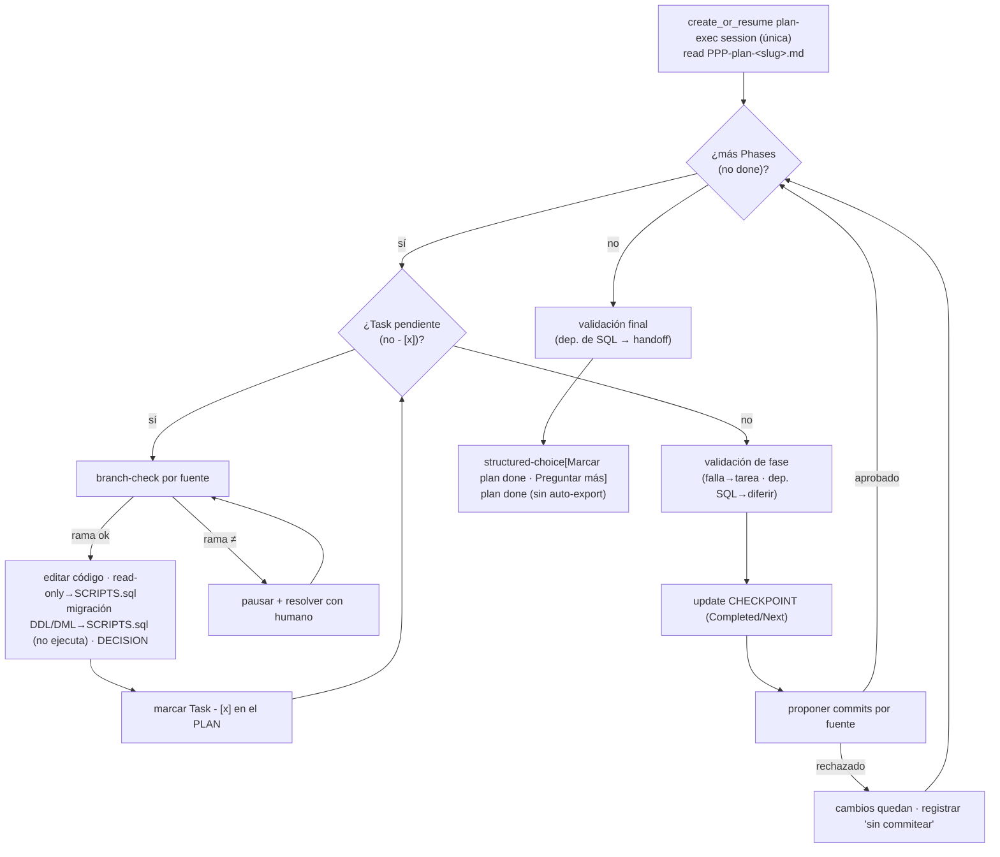

# plan-exec-loop

> **Heir** del chasis [`spec-refine-loop`](../spec-refine-loop/SKILL.md). Aquí los **deltas de ejecución** — el trabajo real: código, BD, git. El motor (gap-driven, research inline, structured-choice + control `flow`, compact/resume, artefactos como log vivo) vive en el chasis.

## Flow
PLAN

## Layer
2 — la IA lo corre entero.

## Started by
`/w:plan-exec` — **reanudable** (mismo mecanismo del chasis; aquí el resume keya off el checkbox del plan-doc + CHECKPOINT, ver Delta 1).

## Reads
`docs/plans/PPP-plan-<slug>.md` (localizar vía glob `docs/plans/PPP-plan-*.md` o la ruta exacta del argumento del comando). Corre **cualquier** plan, haya pasado o no por [`plan-refine-loop`](../plan-refine-loop/SKILL.md) — plan-refine es auxiliar y no obligatorio; no hay gate que lo exija.

## Writes
- `docs/plans/PPP-plan-<slug>.md` (**read/update**, living doc: estado de fases/tareas, `Open questions`).
- Artefactos de la plan-exec session en `.workflow/sessions/` (`SCRIPTS.sql`, `DECISION`, `ANALYSIS-FILE`/`CONCLUSIONS`, …).
- **NO** escribe en otras carpetas `docs/` ni **gradúa/exporta** otros artefactos automáticamente (ver *Boundary*).

## Boundary — sin auto-export (hard rule)

Este loop **nunca gradúa/promueve artefactos** a `docs/`. La única carpeta `docs/` que escribe es **`docs/plans`** (el plan, living). Todo lo demás (migraciones → `docs/scripts`, manuales → `docs/manuals`, diagramas → `docs/diagrams`, etc.) lo hacen skills **`export-*`** aparte, como paso explícito posterior. Los artefactos quedan en sus sessions hasta entonces. Si una tarea crea una herramienta/utilidad, la documenta la skill ambiente `creating-tools` en `docs/tools` (auto-descubierta por su `description`; el workflow es **indiferente**, no la bindea).

## Inherits

Del chasis [`spec-refine-loop`](../spec-refine-loop/SKILL.md), sin cambios:

- **Objetivo persistente + verification-first** del chasis: persigue su `SESSION.Objective` hasta que sus `SESSION.Success criteria` están **en verde** (sembrados al inicio; acá = los tests/validaciones del plan pasan — TDD literal cuando hay código, rúbrica para migraciones BD no ejecutables). El motor es **gap-driven** (aplica *dentro de una tarea* ante una decisión/duda no obvia: research inline ó structured-choice).
- **Structured-choice**: ≤3 preguntas de contenido + 1 control `flow` (`Compactar`/`Cerrar`) siempre (capacidad del arnés — ver [`../../harness/SKILL.md`](../../harness/SKILL.md); en Claude Code es `AskUserQuestion`).
- **Research INLINE** + **regla BD** read-only (pregunta MCP si >1 sin default → `SCRIPTS.sql` → ejecuta read-only) + research **inconclusa** (degrada/difiere, límite `MAX`).
- **Compact/resume**; **artefactos como log vivo** (`CHECKPOINT` siempre; `BACKLOG` solo si difiere).

## Composes

`git` (rama segura + commits propuestos) · `sql` (regla BD). Ambas resueltas por `.workflow/skills.toml`; `off` → el loop sigue sin la capacidad y, si era necesaria, lo dice o pregunta.

> **Convenciones ambientes (no roles).** Los estándares de código, testing, redacción **y la creación de herramientas** (`creating-tools`) **no son roles** del workflow ni se bindean: son **skills standalone que el host auto-descubre por su `description`** y aplica cuando son relevantes. El workflow es **indiferente** (no las lee ni las busca). Familias útiles viven en plugins del marketplace (`dev-conventions`, `tool-builder`), pero el workflow **no depende** de ellos.

## Internal sessions (managed)

- **plan-exec session** descriptor `<slug>-plan-exec` → `NNN-<slug>-plan-exec` (el `<slug>` sale del plan-doc de entrada `docs/plans/PPP-plan-<slug>.md`): **una sola session por run** (Type = `exec`). Dueña del run; posee `SESSION` + `CHECKPOINT` + `DECISION` + `SCRIPTS.sql` (+ `BACKLOG` solo si difiere). La investigación es **inline** dentro de esta session: produce `ANALYSIS-FILE`/`CONCLUSIONS` (+ `SCRIPTS.sql` read-only si consulta BD) en su propia carpeta.

> **Numeración**: el caller pasa solo el descriptor; el CLI antepone el `NNN` global y secuencial sobre `.workflow/sessions/` (ver chasis). No reinicia por tipo.

> **Compat (legacy):** workspaces viejos pueden tener sessions `plan-exec-phase-*` (una por fase) y `*-research-*` — son históricas y se dejan tal cual; los runs nuevos usan una sola session.

## Delta 1 — One session per run; per-phase progress in the plan-doc

- Recorre las `Phases` del plan en orden (respeta deps) **dentro de la única session del run** (no hay session-por-fase).
- El **avance por fase vive en el plan-doc** (`- [x]`) y en el `CHECKPOINT` único (Completed/Pending/Next): **artifact-first** — `CHECKPOINT.Next` se fija a la fase inminente **antes** de iniciarla; el checkbox `- [x]` del plan-doc se voltea **después** de completar la tarea.
- Ejecuta las `Tasks` de la fase; **salta** las ya marcadas `- [x]` en el plan (el plan-doc es la fuente de verdad por tarea). Marca `- [x]` + estado **en el plan** (living doc; no en un `TASKS` aparte).
- En **cada límite de fase**: actualiza el `CHECKPOINT` (Completed += Phase N, Next = Phase N+1) y propone commits.
- Registra `DECISION` solo lo **no obvio**, **a medida que se toma** (los `DECISION` por fase se acumulan en el ÚNICO `DECISION`, etiquetados por fase/tarea — ej. `Origin: T2 (F1)`).

## Delta 2 — Git policy: **rama segura + commits propuestos**

- **Antes de editar** archivos de una fuente: verifica rama actual = rama esperada de esa fuente (estilo `branch-check`). Si no coincide → **pausa y resuelve con el humano**; nunca `stash`/`reset --hard`/`checkout -- .`/`clean` sin confirmación por fuente.
- **Al cerrar una fase** (o al `Cerrar`): **propone commits por fuente** (propose-then-execute, aprobar antes); nunca `push`/`--amend`/`--no-verify`.
- **Commit rechazado**: los cambios **quedan en el working tree** (no se revierten). Se permite reproponer / editar mensaje. Se registra en `CHECKPOINT` + `BACKLOG` que la fase quedó **sin commitear** (reanudable).
- **Precondición entre fases**: `branch-check` valida *identidad* de rama, **no** *limpieza* del working tree. Antes de iniciar la siguiente fase, el working tree de cada fuente debe estar **limpio** (committeado) o explícitamente **reconocido** como "cambios sin commitear de la fase N" — para no co-mezclar dos fases en un mismo commit.

## Delta 3 — DB policy: **la IA nunca ejecuta DML**

Distinción por **ejecución**, no por archivo (ver el esquema `SCRIPTS.sql`):

- **Consultas read-only** (diagnóstico/validación) → `SCRIPTS.sql` (artefacto de la session); la IA **sí** las ejecuta read-only vía MCP (`sql-mutation-guard`).
- **Migraciones DDL/DML** (cambios de esquema/datos) → la IA las **redacta en `SCRIPTS.sql`** (artefacto de la session) pero **NUNCA las ejecuta**.

> El SQL mutante **queda en la session**, no se mueve a `docs/`. Su promoción a `docs/scripts/` (forward + rollback) la hace un `export-*` **aparte**, no este loop.

## Delta 4 — Validation

- Tras ejecutar (por fase y al final): corre tests/checks contra `Validations` + `Final behavior` + acceptance/success criteria del spec.
- Validación que **corre y falla** → vuelve a la tarea (gap); no avanza.
- **Validación dependiente de una migración no aplicada**: como la IA no ejecuta el DML, **no puede correr read-only** → se **difiere** (handoff a DBA), **no bloquea el avance**. Se registra en `Open questions` del plan + `BACKLOG`, marcando "verificación pendiente tras aplicar SQL". (Reusa el patrón degradar/diferir + límite `MAX` del chasis → evita el bucle "vuelve a la tarea".)

> La **validación final** es el **convergence gate** de PLAN-exec = **`Success criteria` en verde** (*verification-first*; análogo al *analyze gate* de SPEC y al *coherence gate* de `plan-new`): el plan no se marca *done* hasta que pasa o queda explícitamente diferida (handoff de SQL). Para código son **tests ejecutables** (TDD); para migraciones BD no ejecutables, **rúbrica** (SCRIPTS.sql válido + revisado).

## Delta 5 — Completitud / cierre

- Una fase cierra **done** cuando sus tareas están `- [x]` y su validación pasó **o** quedó diferida (handoff de SQL). Estado posible: **"done — SQL pendiente de aplicar"**.
- Todas las fases done → *structured-choice* final (contenido: `Marcar plan done` / `Preguntar algo más`; flow: `Compactar`/`Cerrar`).
- **Sin export automático**: los artefactos (`SCRIPTS.sql`, `DECISION`, …) quedan en la session. Promoverlos a `docs/` (scripts, manuals, …) es un paso aparte vía `export-*`.

## Sequence

```
plan-exec-loop(PPP-plan-<slug>.md):
  session = create_or_resume("<slug>-plan-exec")           # <slug> del plan-doc; UNA sola session por run; CLI antepone NNN global; CHECKPOINT, resume
  plan = read(PPP-plan-<slug>.md)
  para cada Phase en plan (en orden, respeta deps):
    si Phase done (todas sus Tasks - [x] en el plan): skip # resume vía checkbox del plan-doc
    seed CHECKPOINT.Next = Phase N (Pending = sus Tasks)   # ANTES de iniciar la fase: sembrar intención (artifact-first)
    para cada Task de la Phase:
      si Task - [x] en el plan: skip                       # resume intra-fase por checkbox
      verificar rama esperada por fuente (branch-check)
        si no coincide → pausar + resolver con humano
      ejecutar Task:
        editar código en las fuentes (cambio mínimo)
        si crea herramienta/utilidad → la skill ambiente creating-tools la documenta en docs/tools
        si consulta BD read-only → SCRIPTS.sql + ejecutar read-only
        si cambio BD (DDL/DML) → redactar en SCRIPTS.sql (artefacto session, NO ejecutar)
        si decisión no obvia → DECISION (etiquetado por fase/tarea, en el ÚNICO DECISION)
        si duda/gap → research inline ó structured-choice    # chasis
      marcar Task - [x] + estado EN EL PLAN                # DESPUÉS de completar la Task (el plan-doc es la fuente de verdad por tarea)
    validación de la fase:
        la que corre y falla → volver a la tarea
        la dependiente de migración no aplicada → diferir (Open questions + BACKLOG)
    update CHECKPOINT (Completed += Phase N, Next = Phase N+1) # DESPUÉS: Pending→Completed + Next = fase siguiente (ver ciclo artifact-first)
    proponer commit(s) por fuente (aprobar antes)          # nunca push/amend/--no-verify
        si rechazado → cambios quedan; registrar "fase sin commitear"
    precondición siguiente fase: working tree limpio o reconocido
  validación final (lo que se pueda; lo dependiente de SQL queda como handoff)
  structured_choice(contenido: [Marcar plan done, Preguntar algo más], flow: [Compactar, Cerrar])
  marcar plan done (o "done — SQL pendiente de aplicar")
  # NO export: los artefactos quedan en la session; un export-* los promueve aparte
finalize: CHECKPOINT (+ BACKLOG si difiere) + cerrar session + reportar
```



## Convergence / exit

- Plan completo + validación OK (o diferida con handoff) → `Marcar plan done`.
- `Cerrar` (control `flow`, en cualquier momento) → `finalize` persiste `CHECKPOINT` (y `BACKLOG` solo si quedó algo sin ejecutar / sin commitear / sin aplicar), cierra la session, reporta.
- La promoción de artefactos a `docs/` (vía `export-*`) es **siempre** un paso posterior y explícito, fuera de este loop.
