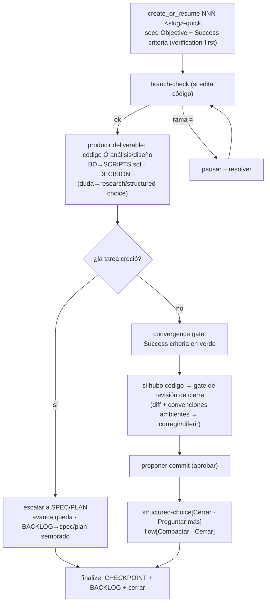

# quick-loop

> **Heir** del chasis [`spec-refine-loop`](../spec-refine-loop/SKILL.md) + las políticas de ejecución de [`plan-exec-loop`](../plan-exec-loop/SKILL.md). Aquí **solo** los deltas de QUICK.

## Flow
QUICK

## Layer
2 — la IA lo corre entero (loop mínimo).

## Started by
`/w:quick` — **reanudable** (mismo mecanismo de resume del chasis).

## Reads
— (el prompt del usuario; no hay documento de entrada).

## Writes
- **Deliverable según la tarea:** edita código en las fuentes (cambio mínimo) **o** produce un **análisis/diseño** acotado (deliverable no-código, vive en los artefactos de la session — no en `docs/`).
- Artefactos de la session en `.workflow/sessions/`.
- **NO toca `docs/`** (sin doc, sin auto-export). Un análisis/diseño que amerite preservarse se promueve aparte (`export-*`) o se escala a SPEC/PLAN.

## Internal session

- **SIEMPRE** crea una session ligera con descriptor `<slug>-quick` → `NNN-<slug>-quick` (Type = `quick`, ≈ `exec`): `SESSION` · `DECISION` · `SCRIPTS.sql` · `CHECKPOINT` (+ `BACKLOG` solo si difiere). Una sola session. La investigación es **inline** dentro de ella (`ANALYSIS-FILE`/`CONCLUSIONS` + `SCRIPTS.sql` read-only en su carpeta). El caller pasa solo el descriptor; el CLI antepone el `NNN` global y secuencial (ver chasis).

## Inherits

- del **chasis** [`spec-refine-loop`](../spec-refine-loop/SKILL.md): **objetivo persistente** (acá el más directo: el prompt *es* el objetivo) + **verification-first** (`SESSION.Success criteria` proporcional), gap-driven (mínimo), *structured-choice* ≤3 preguntas de contenido + 1 control `flow` (`Compactar`/`Cerrar`) (capacidad del arnés — ver [`../../harness/SKILL.md`](../../harness/SKILL.md); en Claude Code es `AskUserQuestion`), `research` **inline** + regla BD read-only (pregunta MCP si >1 sin default → `SCRIPTS.sql` → ejecuta read-only), compact/resume, **artefactos como log vivo (ciclo artifact-first)** (`CHECKPOINT` siempre; `BACKLOG` solo si difiere).
- de [`plan-exec-loop`](../plan-exec-loop/SKILL.md): **git** (rama segura antes de editar + commit propuesto; nunca `push`/`--amend`/`--no-verify`), **BD** (la IA nunca ejecuta DML; migraciones → `SCRIPTS.sql` de la session), **sin auto-export** (no toca otras carpetas `docs/`), y el **gate de revisión de cierre** (§ *Delta 5* de plan-exec) en versión **proporcional**: antes de proponer el único commit, re-lectura del diff aplicando las convenciones ambientes instaladas → corregir o diferir justificado.

## Composes

`git` · `sql` (regla BD) · `research` (inline). Resueltas por `.workflow/skills.toml`.

> **Convenciones ambientes (no roles).** Los estándares de código, testing, redacción **y la creación de herramientas** (`creating-tools`) **no son roles** del workflow ni se bindean: son **skills standalone que el host auto-descubre por su `description`** y aplica cuando son relevantes. El workflow es **indiferente** (no las lee ni las busca). Familias útiles viven en plugins del marketplace (`dev-conventions`, `tool-builder`), pero el workflow **no depende** de ellos.

## Delta QUICK — minimal ceremony

- **Sin fases, sin plan-doc**: el prompt **es** la tarea (una sola unidad). No hay roadmap.
- **Verification-first proporcional** (ceremonia mínima): aun acá se **siembra el check antes**, del tamaño de la tarea. Código: un test (repro del bug → fix) o "build/lint/tests existentes siguen verdes" (chore). **Análisis/diseño**: una **rúbrica falsable corta**, *ratificada por el usuario* antes de perseguirla. Es el `SESSION.Success criteria` del run (ver [chasis § Verification-first](../spec-refine-loop/SKILL.md)).
- **Una sola session**. **Un solo commit** propuesto al final (solo si hubo cambios de código), **tras el gate de revisión de cierre proporcional** (heredado de plan-exec § *Delta 5*): re-lectura del diff + convenciones ambientes; corregir o diferir; nada llega al commit sin revisar.
- **Escalación + handoff**: si la tarea crece (muchos archivos / ≥2 fuentes / necesita arquitectura) → propone subir a **SPEC/PLAN**. Si el usuario acepta:
  - el **código ya editado queda** en el working tree (no se revierte) **y se registra** en `CHECKPOINT` + `BACKLOG` ("cambios sin commitear en `<fuente>` — código a medias; decidir commit/descartar al retomar") — reusando **ambas** mitades del patrón "commit rechazado" de plan-exec (no revertir **y** registrar lo sin commitear). Crítico en la rama **SPEC**, que no retoma el working tree;
  - la session quick va a `finalize`, persistiendo `CHECKPOINT` + `BACKLOG` con un **puntero** al spec/plan sembrado (Followups: "escalado a `docs/specs/NNN` o `docs/plans/PPP` — retomar ahí");
  - los artefactos (`DECISION`, `SCRIPTS.sql`) **quedan en la session quick** como contexto referenciable por la nueva session (no se migran);
  - **asimetría**: escalar a **PLAN** puede **absorber** el avance (plan-exec retoma el working tree existente); escalar a **SPEC** **reinicia** el ciclo de diseño y trata el código a medias como **contexto/referencia**, no como trabajo ya ingerido.

## Continuidad entre prompts (contexto operativo)

`quick` es donde la **regla de continuidad** (ver [`../../SKILL.md`](../../SKILL.md) § *Contexto operativo*) se ve más claro. Dentro de un workspace:

1. `/w:quick "primer prompt"` (**comando**) → crea la session `NNN-<slug>-quick`, arranca el loop. Los scripts van a **su** `SCRIPTS.sql`.
2. `"segundo prompt"` (**sin comando**, trabajo relacionado) → **no** crea otra session: **continúa/reabre la más reciente** (la del paso 1) y agrega los nuevos scripts a **esa misma** `SCRIPTS.sql`.
3. `/w:quick "tercer prompt"` (**comando** otra vez) → **nueva** session, nuevo loop.

> El **comando** señala "nueva línea de trabajo"; un **prompt pelado** es "sigo en la misma" → por default continúa/reabre la más reciente (la *última iniciada*). Si es claramente no-relacionado, ofrece elegir (`continuar NNN` | `trabajo nuevo`) o cae a la rama **sin flujo** (escribe en `docs/` por convención + numeración). Sin workspace → comportamiento **vanilla**.

## Sequence

```
quick-loop(prompt):
  s = create_or_resume("<slug>-quick")      # CLI antepone NNN global; siempre session ligera
  seed SESSION.Objective = el prompt
  seed SESSION.Success criteria = check del deliverable     # verification-first, ANTES: test(s) si código · rúbrica corta RATIFICADA si análisis/diseño
  seed CHECKPOINT.Pending/Next = la tarea (s)               # ANTES: sembrar intención (artifact-first)
  trabajar la tarea (loop mínimo):
    si edita código → verificar rama esperada por fuente (branch-check); si no → pausar + resolver
    producir el deliverable: editar código (cambio mínimo) Ó autorar el análisis/diseño
    si consulta BD read-only → SCRIPTS.sql + ejecutar read-only
    si cambio BD (DDL/DML) → SCRIPTS.sql (artefacto session, NO ejecutar)
    si decisión no obvia → DECISION
    si duda/gap → research inline ó structured-choice         # chasis
    si la tarea CRECE → proponer escalar a SPEC/PLAN
        si acepta → handoff (avance queda; BACKLOG→spec/plan sembrado) → goto finalize
  convergence gate: Success criteria en verde                # tests verdes si código · rúbrica satisfecha si análisis/diseño
  si hubo cambios de código:
    gate de revisión de cierre (proporcional):               # re-lectura del diff + convenciones ambientes instaladas
        hallazgos → corregir (re-validar) ó diferir justificado (BACKLOG)
    proponer commit (aprobar antes)                          # nunca push/amend/--no-verify; solo tras el gate
  structured_choice(contenido: [Cerrar tarea, Preguntar algo más], flow: [Compactar, Cerrar])
finalize: CHECKPOINT (DESPUÉS: Pending→Completed) + BACKLOG (solo si queda algo diferido) + cerrar session + reportar
```



## Convergence / exit

- **Success criteria en verde** (proporcional) + gate de revisión de cierre pasado y commit propuesto si hubo código (o aprobado saltarlo) → `Cerrar`.
- `Cerrar`/`Compactar` (control `flow`) → persiste `CHECKPOINT` + `BACKLOG` (reanudable).
- **Sin export**: nada va a `docs/`. Si algo amerita preservarse → se promueve aparte vía `export-*`, o se escala a SPEC/PLAN.

> El *convergence gate* de QUICK es **verification-first proporcional**: un `Success criteria` **corto** sembrado al inicio (no la *ausencia* de checklist, sino su versión mínima) — para código, "el cambio hace lo que pedía el prompt + tests/build verdes"; para análisis/diseño, una rúbrica corta ratificada. Mínima ceremonia por diseño, pero **siempre con el check declarado antes**.
