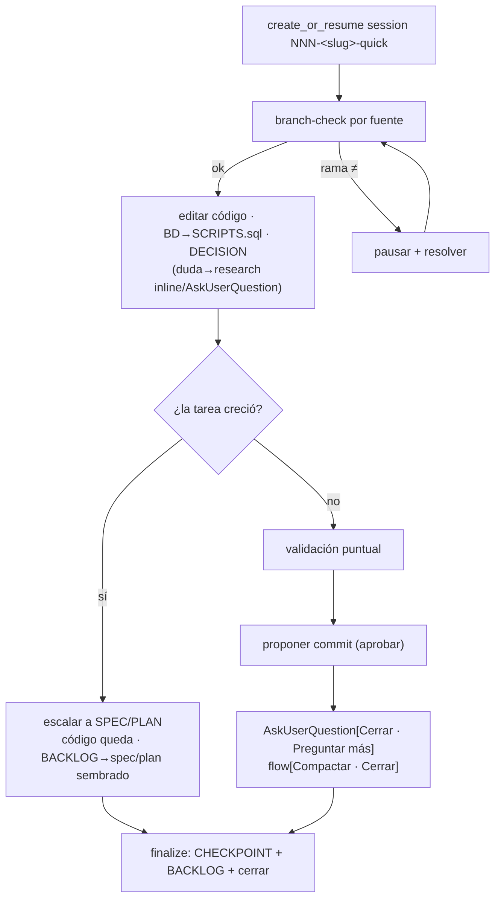

# quick-loop

> **Heir** del chasis [`spec-refine-loop`](../spec-refine-loop/SKILL.md) + las políticas de ejecución de [`plan-exec-loop`](../plan-exec-loop/SKILL.md). Aquí **solo** los deltas de QUICK.

## Flow
QUICK

## Layer
2 — la IA lo corre entero (loop mínimo).

## Started by
`/w:quick` — **reanudable** (mismo mecanismo de resume del chasis).

## Reads
— (el prompt del usuario; no hay documento de entrada).

## Writes
- Edita código en las fuentes (cambio mínimo).
- Artefactos de la session en `.workflow/sessions/`.
- **NO toca `docs/`** (sin doc, sin auto-export).

## Internal session

- **SIEMPRE** crea una session ligera con descriptor `<slug>-quick` → `NNN-<slug>-quick` (Type = `quick`, ≈ `exec`): `SESSION` · `DECISION` · `SCRIPTS.sql` · `CHECKPOINT` (+ `BACKLOG` solo si difiere). Una sola session. La investigación es **inline** dentro de ella (`ANALYSIS-FILE`/`CONCLUSIONS` + `SCRIPTS.sql` read-only en su carpeta). El caller pasa solo el descriptor; el CLI antepone el `NNN` global y secuencial (ver chasis).

## Inherits

- del **chasis** [`spec-refine-loop`](../spec-refine-loop/SKILL.md): gap-driven (mínimo), `AskUserQuestion` ≤3 + `flow` (`Compactar`/`Cerrar`), `research` **inline** + regla BD read-only (pregunta MCP si >1 sin default → `SCRIPTS.sql` → ejecuta read-only), compact/resume, **artefactos como log vivo (ciclo artifact-first)** (`CHECKPOINT` siempre; `BACKLOG` solo si difiere).
- de [`plan-exec-loop`](../plan-exec-loop/SKILL.md): **git** (rama segura antes de editar + commit propuesto; nunca `push`/`--amend`/`--no-verify`), **BD** (la IA nunca ejecuta DML; migraciones → `SCRIPTS.sql` de la session), **sin auto-export** (no toca otras carpetas `docs/`).

## Composes

`git` · `coding-standards` · `testing` (validación puntual) · `sql` (regla BD) · `writing` · `research` (inline). Resueltas por `.workflow/skills.toml`.

## Delta QUICK — minimal ceremony

- **Sin fases, sin plan-doc**: el prompt **es** la tarea (una sola unidad). No hay roadmap.
- **Una sola session**. **Un solo commit** propuesto al final.
- **Escalación + handoff**: si la tarea crece (muchos archivos / ≥2 fuentes / necesita arquitectura) → propone subir a **SPEC/PLAN**. Si el usuario acepta:
  - el **código ya editado queda** en el working tree (no se revierte) **y se registra** en `CHECKPOINT` + `BACKLOG` ("cambios sin commitear en `<fuente>` — código a medias; decidir commit/descartar al retomar") — reusando **ambas** mitades del patrón "commit rechazado" de plan-exec (no revertir **y** registrar lo sin commitear). Crítico en la rama **SPEC**, que no retoma el working tree;
  - la session quick va a `finalize`, persistiendo `CHECKPOINT` + `BACKLOG` con un **puntero** al spec/plan sembrado (Followups: "escalado a `docs/specs/NNN` o `docs/plans/PPP` — retomar ahí");
  - los artefactos (`DECISION`, `SCRIPTS.sql`) **quedan en la session quick** como contexto referenciable por la nueva session (no se migran);
  - **asimetría**: escalar a **PLAN** puede **absorber** el avance (plan-exec retoma el working tree existente); escalar a **SPEC** **reinicia** el ciclo de diseño y trata el código a medias como **contexto/referencia**, no como trabajo ya ingerido.

## Sequence

```
quick-loop(prompt):
  s = create_or_resume("<slug>-quick")      # CLI antepone NNN global; siempre session ligera
  seed CHECKPOINT.Pending/Next = la tarea (s)   # ANTES: sembrar intención (artifact-first); SESSION.Objective = el prompt
  trabajar la tarea (loop mínimo):
    verificar rama esperada por fuente (branch-check); si no → pausar + resolver
    editar código (cambio mínimo)
    si consulta BD read-only → SCRIPTS.sql + ejecutar read-only
    si cambio BD (DDL/DML) → SCRIPTS.sql (artefacto session, NO ejecutar)
    si decisión no obvia → DECISION
    si duda/gap → research inline ó AskUserQuestion         # chasis
    si la tarea CRECE → proponer escalar a SPEC/PLAN
        si acepta → handoff (código queda; BACKLOG→spec/plan sembrado) → goto finalize
  validación puntual (test si aplica)
  proponer commit (aprobar antes)                            # nunca push/amend/--no-verify
  AskUserQuestion(contenido: [Cerrar tarea, Preguntar algo más], flow: [Compactar, Cerrar])
finalize: CHECKPOINT (DESPUÉS: Pending→Completed) + BACKLOG (solo si queda algo diferido) + cerrar session + reportar
```



## Convergence / exit

- Tarea hecha + commit (o aprobado saltarlo) → `Cerrar`.
- `Cerrar`/`Compactar` (tab flow) → persiste `CHECKPOINT` + `BACKLOG` (reanudable).
- **Sin export**: nada va a `docs/`. Si algo amerita preservarse → se promueve aparte vía `export-*`, o se escala a SPEC/PLAN.
