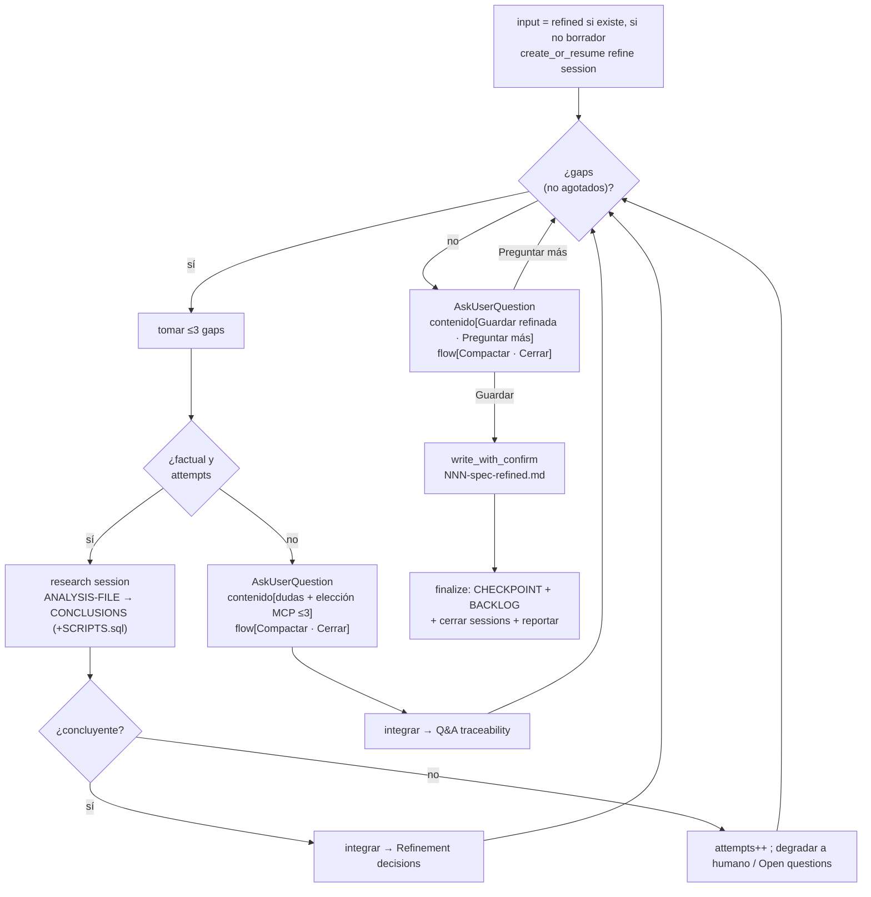

# spec-refine-loop

> **El CHASIS.** Primer loop diseñado en detalle; patrón de referencia que heredan los demás loops (`plan-new-loop`, `plan-exec-loop`, `quick-loop`). Si editas el motor, edítalo aquí.

## Flow
SPEC

## Layer
2 — la IA lo corre entero (gap-driven). El usuario no conduce el ciclo; solo responde tabs de contenido y dirige el ciclo de vida por el tab `flow`.

## Started by
`/w:spec-refine` — **reanudable**. Detecta el estado previo y arranca según corresponda (ver *Compact / resume*, 4 casos).

## Reads
- `docs/specs/NNN-spec.md` (borrador), **o**
- `docs/specs/NNN-spec-refined.md` si **ya existe** un refinado previo → se re-refina incremental sobre el refined (NO sobre el borrador stale).

## Writes
`docs/specs/NNN-spec-refined.md` (cuando el usuario elige `Guardar especificación refinada`). Si el archivo **ya existe**, **sobrescribe con confirmación** del usuario.

> **Invariante de boundary:** este loop escribe **solo** en `docs/specs`. Nunca gradúa/exporta otros artefactos a `docs/` — eso es trabajo de `export-*`, aparte.

## Internal sessions (managed)

El loop crea y maneja sus sessions en `.workflow/sessions/`. El usuario nunca las crea.

| Session | When | Artifacts | Role |
|---|---|---|---|
| **refine session** `<spec>-spec-refine/` | al arrancar el loop (o se reanuda) | `SESSION.md` · `CHECKPOINT.md` (· `BACKLOG.md` al cerrar) | Dueña del run. Guarda el avance al `Compactar` y al `Cerrar`; habilita el resume. Type = `refine`. |
| **research session** `<run>-research-*/` | on-demand, por cada gap factual | `SESSION.md` · `ANALYSIS-FILE.md` → `CONCLUSIONS.md` (+ `SCRIPTS.sql` si consulta BD) | Investiga, concluye, **cierra y reporta**. Puede cerrar **inconclusa**. Type = `research`; on-demand, **no reanudable** (run-and-close, sin `CHECKPOINT`/`BACKLOG` propios). |

> El spec **nunca** entra en una session; vive en `docs/specs/`.
>
> `<run>` = id de la session dueña del loop padre, que prefija sus sessions hijas: `<spec>-spec-refine`, `<plan>-plan-new`, `<plan>-plan-exec`, `<slug>-quick`. Así el patrón de naming es exacto en cualquier flujo que herede este chasis.

**CLI** (asunción de naming; los subcomandos se implementan en paralelo — no bloquear):
- `aw session-create --type refine --name <spec>-spec-refine` / `aw session-resume --code <…>` (detecta `CHECKPOINT`).
- `aw session-create --type research --name <run>-research-<gap>` para cada gap factual.
- `aw checkpoint-write` / `aw checkpoint-read` para el resume.
- `aw session-close` al cerrar (con razón); `aw session-artifacts` para inspeccionar.

## Composes

Cuando el requerimiento involucra **UI**, compone la capacidad **`ui-design`** (default built-in `ui-spec`; rebindeable vía `.workflow/skills.toml`): autora el UI spec nativamente (esquema `Screen`, vocabulario, formato). El loop aporta la iteración/Q&A que el viejo servicio no tenía (design-system, tema, variantes, desambiguación) y lo integra como sección `## UI spec` del spec.

Otras capacidades transversales que el chasis usa siempre: `research` (research on-demand), `sql` (regla BD en research), `writing` (redacción del refined). Todas se resuelven por config; `off` → el loop sigue sin la capacidad y, si era necesaria, lo dice o pregunta.

## Deliverable schema (`NNN-spec-refined.md`)

Más rico que el borrador: mismas secciones **completadas** + dos nuevas (`Refinement decisions`, `Q&A traceability`).

```markdown
# Spec NNN (refined) — <slug>

> Derivado de `NNN-spec.md` · refinado por spec-refine-loop

## Requirement            (afinado, sin ambigüedad)
## Context                (completo)
## Scope                  (In / Out claros)
## Acceptance criteria    (testables, - [ ])
## Assumptions            (declarados)

## UI spec                (opt. — si involucra UI; vía capacidad ui-design / skill ui-spec)
Screen (JSON) + render Markdown.

## Refinement decisions   ← NEW
Qué se definió al refinar y por qué. Incluye lo resuelto vía research
(con referencia a la research session / CONCLUSIONS).

## Q&A traceability       ← NEW
Cada duda preguntada al humano + la respuesta elegida.

## Open questions         (idealmente "None"; lo que quede se difiere)
```

## Gap taxonomy (= weak sections of the schema)

`detect_gaps(work)` busca estas señales; cada una tiene un resolutor:

| Gap | Signal | Resolved by |
|---|---|---|
| Requirement vago | el qué/por qué ambiguo | **humano** |
| Context incompleto | sistemas/componentes sin identificar | **research** |
| Scope borroso | falta `Out`, o In/Out se solapan | **humano** |
| Criterios no testables | acceptance no verificable | **humano** (derivar + confirmar) |
| Open questions abiertas | dudas explícitas | según naturaleza |
| Supuestos ocultos | el spec asume cosas no dichas | **research** valida / **humano** confirma |
| Contradicción interna | secciones que se contradicen | **humano** |

## Ask-vs-research rule (el discriminador)

Para cada gap, una sola pregunta decide el resolutor:

> *"¿Puedo responder esto leyendo el repo/datos?"* → **research** (autónomo).
> *"¿Depende de lo que el usuario quiere?"* → **preguntar al humano** (AskUserQuestion).

## Research: autonomy, scope & failure

- **Autónomo**: la IA crea la research session, investiga y reporta **sin pedir permiso**. El humano se entera al integrarse (en `Refinement decisions`) y mantiene control vía el tab `flow`.
- **Alcance**: workspace + repos asociados (fuentes) + MCPs de BD.
- **Regla BD** (única excepción a la autonomía):
  1. **Elección de MCP**: si el gap requiere BD y hay **>1 MCP candidato sin default configurado**, la IA pregunta cuál usar. Esa pregunta va por el **mismo `AskUserQuestion`** como un **tab de contenido** (cuenta dentro del límite ≤3 + `flow`), **antes** de ejecutar queries. Si hay un único MCP o un default, no pregunta.
  2. Escribe **primero** las queries en `SCRIPTS.sql` de la research session.
  3. Las ejecuta **read-only** vía MCP (respeta `sql-mutation-guard`: nunca DML/DDL).
- **Research inconclusa** (BD no disponible, evidencia insuficiente, gap factual irresoluble):
  - La research session cierra con estado **`inconcluso`** y reporta el motivo (vía su `Success criteria` no cumplido).
  - El loop **degrada** el gap: lo pasa a **pregunta-al-humano** (próximo batch → `Q&A traceability`) o, si tampoco aplica, lo **difiere** a `## Open questions` del refined.
  - El gap se marca **"ya intentado vía research"** (`attempts[gap]++`, límite `MAX`) para que `detect_gaps` **no lo re-dispare en bucle** → garantiza convergencia.

## AskUserQuestion (design & batching)

- Límite del host: **máx 4 preguntas/llamada**. Como el tab `flow` va **siempre** → **≤3 tabs de contenido + 1 tab `flow`**.
- **tab `flow`** (ciclo de vida, siempre presente): `Compactar` | `Cerrar`. Responder solo los tabs de contenido (sin tocar `flow`) = seguir iterando.
- **Tabs de contenido** posibles:
  - dudas-de-humano (gaps no factuales);
  - elección de MCP (regla BD) — antes de ejecutar queries;
  - en **convergencia**, acción: `Guardar especificación refinada` | `Preguntar algo más`.
- **Batching**: agrupar hasta 3 gaps de humano en una sola llamada. Si hay más de 3 pendientes, priorizar (los que desbloquean otros gaps primero) y diferir el resto a la próxima vuelta.

## Sequence

```
spec-refine-loop(spec):
  input = exists(NNN-spec-refined.md) ? NNN-spec-refined.md : NNN-spec.md   # (#2 resume)
  refine_session = create_or_resume(<spec>-spec-refine)    # detecta CHECKPOINT
  work = read(input)  (+ aplicar avance del checkpoint si reanuda)
  attempts = {}                                            # anti-relanzamiento por gap
  repeat:
    gaps = detect_gaps(work)  menos los gaps "agotados"
    if gaps == ∅: break
    batch = top ≤3 gaps ; pending_human = []
    para cada gap en batch:
      si factual(gap) y attempts[gap] < MAX:
        si requiere BD y >1 MCP sin default → encolar "elección MCP" en pending_human
        rs  = create_research_session(gap)
        res = rs.run_and_close()             # ANALYSIS-FILE → CONCLUSIONS (+SCRIPTS.sql)
        si res.concluyente: work = integrate(work, res)    # → Refinement decisions
        si no: attempts[gap]++ ; si attempts[gap] >= MAX → pending_human.push(gap)
      si no:
        pending_human.push(gap)
    si pending_human no vacío:
      ans = AskUserQuestion(contenido: pending_human (≤3), flow: [Compactar, Cerrar])
      switch(flow):
        Compactar → write CHECKPOINT (refine_session) ; /compact ; continue
        Cerrar    → goto finalize
      work = integrate(work, ans)            # → Q&A traceability / Open questions
  # convergió:
  ans = AskUserQuestion(contenido: [Guardar refinada, Preguntar algo más],
                        flow: [Compactar, Cerrar])
  Guardar          → write_with_confirm(NNN-spec-refined.md) ; goto finalize   # (#2)
  Preguntar algo más → continue
  flow Compactar/Cerrar → manejar igual
finalize:
  write CHECKPOINT (refine_session)                        # (#5) persiste siempre
  write/update BACKLOG (motivo de cierre + Open questions diferidas)   # (#5)
  cerrar research sessions abiertas ; cerrar refine_session ; reportar
```



## Compact / resume

Cuatro casos al ejecutar `/w:spec-refine` sobre un spec:

1. **En curso** (existe `CHECKPOINT.md` en la refine session) → reanuda desde el avance (gaps resueltos, Q&A, `attempts`, research sessions abiertas).
2. **Sin avance** (no hay CHECKPOINT ni refined) → arranca desde cero leyendo `NNN-spec.md`.
3. **Ya completado** (existe `NNN-spec-refined.md`, sin CHECKPOINT) → re-refinamiento incremental: input = el **refined** (no el borrador); al `Guardar`, sobrescribe con confirmación.
4. **`Compactar`** (tab flow) → escribe `CHECKPOINT.md` en la refine session (spec en progreso, gaps restantes, Q&A, `attempts`, research sessions abiertas) → dispara `/compact` del host → reanuda leyendo el checkpoint.

## Convergence / exit

- **Sin gaps materiales** → ofrece `Guardar especificación refinada`.
- `Guardar` → `write_with_confirm(NNN-spec-refined.md)` y `finalize`.
- `Cerrar` (tab flow, en cualquier momento) → `finalize`. **`finalize` persiste siempre**: escribe `CHECKPOINT.md` (reanudable) **y** `BACKLOG.md` (motivo de cierre + `Open questions` diferidas), cierra sessions y reporta. Así sobrevive el avance aunque no se haya `Compactar` antes.

## Integration (dónde aterriza cada resolución)

- Resuelto vía **research** → `## Refinement decisions` del refined (+ ref a la research session / `CONCLUSIONS`).
- Resuelto vía **humano** → `## Q&A traceability` del refined.
- **Research inconclusa o sin resolver** → `## Open questions` del refined (diferido) + `BACKLOG.md` de la refine session al cerrar.

## Heredan este chasis

- `plan-new-loop` — mismo motor; deltas: plan rico + gap taxonomy de plan.
- `plan-exec-loop` — mismo motor; deltas: ejecución real (código/BD/git), session por fase, sin auto-export.
- `quick-loop` — mismo motor (mínimo); hereda además git/BD/no-export de `plan-exec-loop`.
