# spec-refine-loop

> **El CHASIS.** Primer loop diseñado en detalle; patrón de referencia que heredan los demás loops (`plan-new-loop`, `plan-exec-loop`, `quick-loop`). Si editas el motor, edítalo aquí.

## Flow
SPEC

## Layer
2 — la IA lo corre entero (gap-driven). El usuario no conduce el ciclo; solo responde tabs de contenido y dirige el ciclo de vida por el tab `flow`.

## Started by
`/w:spec-refine` — **reanudable**. Detecta el estado previo (vía CHECKPOINT) y arranca según corresponda (ver *Compact / resume*).

## Reads
- `docs/specs/NNN-spec*.md` (glob — localiza el spec por número, también captura el legacy `NNN-spec.md`), **o** la ruta exacta pasada en `$ARGUMENTS`. **Siempre el spec mismo**: este loop lo edita in place, no hay un archivo "refined" aparte.

## Writes
Actualiza `docs/specs/NNN-spec-<slug>.md` **in place** (cuando el usuario elige `Guardar especificación refinada`): completa secciones y **agrega** `## Refinement decisions` + `## Q&A traceability`, cerrando `Open questions` a medida que se resuelven. Como sobrescribe un doc existente, **con confirmación** del usuario.

> **Invariante de boundary:** este loop escribe **solo** en `docs/specs`. Nunca gradúa/exporta otros artefactos a `docs/` — eso es trabajo de `export-*`, aparte.

## Artifacts as a live log (chasis — heredado por todos los loops)

El loop mantiene sus artefactos como **registro vivo**, no solo al cerrar:

- **`CHECKPOINT`** se actualiza en **cada límite de gap/fase** (Completed/Pending/Next), no únicamente al `Compactar`/`Cerrar`.
- **`DECISION`** se registra **a medida que se toma** una decisión no obvia.
- **`BACKLOG`** se escribe **solo cuando hay algo diferido/followup** (`session-close` ya no fabrica un BACKLOG vacío).

> Los artefactos de session son el **registro vivo** del run; el spec/plan es la **base guía**.

## Internal sessions (managed)

El loop crea y maneja su session en `.workflow/sessions/`. El usuario nunca la crea.

| Session | When | Artifacts | Role |
|---|---|---|---|
| **refine session** `NNN-spec-refine/` | al arrancar el loop (o se reanuda) | `SESSION.md` · `CHECKPOINT.md` (· `BACKLOG.md` solo si difiere) | Dueña del run. Mantiene el avance vivo (CHECKPOINT) y habilita el resume. Type = `refine`. |

> **Research INLINE** — la investigación ya **no** es una session aparte: es una actividad **dentro de la session actual** que escribe sus artefactos (`ANALYSIS-FILE`/`CONCLUSIONS`, + `SCRIPTS.sql` read-only si consulta BD) **en la carpeta de la propia session del run**. Ver *Research: autonomy, scope & failure*.

> El spec **nunca** entra en una session; vive en `docs/specs/`.

> **Compat (legacy):** workspaces viejos pueden tener `NNN-spec.md` / `NNN-spec-refined.md` y sessions `*-research-*` aparte — son históricos y se dejan tal cual. El glob `NNN-spec*.md` igual encuentra el spec base, y re-correr spec-refine lo edita in place de ahí en adelante.

### Numeración de sessions (regla dura, heredada por todos los loops)

El **CLI es dueño del número**: `aw session-create` antepone un `NNN` **global y secuencial** escaneando **todas** las sessions de `.workflow/sessions/` (cualquier tipo). El caller pasa **solo el descriptor** vía `--name` — **nunca** un número. Así la numeración no se reinicia por tipo ni colisiona (ej.: `001-spec-refine`, `002-plan-new`, `003-plan-exec`, …).

> `<run>` = el **descriptor** (sin número) de la session del run: `spec-refine`, `plan-new`, `plan-exec`, `quick`. Como la investigación es **inline** en esta misma session, ya no hay sessions hijas `*-research-*` que numerar (compat: las viejas son históricas).
>
> **Resume**: localiza la session existente **escaneando** `.workflow/sessions/` por descriptor + `## Origin` (qué spec/plan), **no** reconstruyendo el número (que es global, no derivable del artefacto). `aw session-resume --code <NNN | folder>` resuelve ambas formas.

**CLI**:
- `aw session-create --type refine --name spec-refine` → crea `NNN-spec-refine` / `aw session-resume --code <…>` (detecta `CHECKPOINT`).
- `aw checkpoint-write` / `aw checkpoint-read` para el resume.
- `aw session-close` al cerrar (con razón); `aw session-artifacts` para inspeccionar.

## Composes

Cuando el requerimiento involucra **UI**, compone la capacidad **`ui-design`** (default built-in `ui-spec`; rebindeable vía `.workflow/skills.toml`): autora el UI spec nativamente (esquema `Screen`, vocabulario, formato). El loop aporta la iteración/Q&A que el viejo servicio no tenía (design-system, tema, variantes, desambiguación) y lo integra como sección `## UI spec` del spec.

Otras capacidades transversales que el chasis usa siempre: `research` (research **inline**, ver abajo), `sql` (regla BD en research), `writing` (redacción del spec). Todas se resuelven por config; `off` → el loop sigue sin la capacidad y, si era necesaria, lo dice o pregunta.

## Deliverable schema (el spec, editado in place)

El spec se completa **in place**: mismas secciones del borrador **completadas** + dos nuevas que se **agregan** (`Refinement decisions`, `Q&A traceability`). NO se crea un archivo aparte.

```markdown
# Spec NNN — <slug>

> Refinado in place por spec-refine-loop

## Requirement            (afinado, sin ambigüedad)
## Context                (completo)
## Scope                  (In / Out claros)
## Acceptance criteria    (testables, - [ ])
## Assumptions            (declarados)

## UI spec                (opt. — si involucra UI; vía capacidad ui-design / skill ui-spec)
Screen (JSON) + render Markdown.

## Refinement decisions   ← NEW (se AGREGA)
Qué se definió al refinar y por qué. Incluye lo resuelto vía research inline
(con referencia a las CONCLUSIONS de la session).

## Q&A traceability       ← NEW (se AGREGA)
Cada duda preguntada al humano + la respuesta elegida.

## Open questions         (idealmente "None"; lo que quede se difiere)
```

## Gap taxonomy (= weak sections of the schema)

`detect_gaps(work)` busca estas señales; cada una tiene un resolutor:

| Gap | Signal | Resolved by |
|---|---|---|
| Requirement vago | el qué/por qué ambiguo | **humano** |
| Context incompleto | sistemas/componentes sin identificar | **research** |
| Scope borroso | falta `Out`, o In/Out se solapan | **humano** |
| Criterios no testables | acceptance no verificable | **humano** (derivar + confirmar) |
| Open questions abiertas | dudas explícitas | según naturaleza |
| Supuestos ocultos | el spec asume cosas no dichas | **research** valida / **humano** confirma |
| Contradicción interna | secciones que se contradicen | **humano** |

## Ask-vs-research rule (el discriminador)

Para cada gap, una sola pregunta decide el resolutor:

> *"¿Puedo responder esto leyendo el repo/datos?"* → **research** (autónomo).
> *"¿Depende de lo que el usuario quiere?"* → **preguntar al humano** (AskUserQuestion).

## Research: autonomy, scope & failure

La investigación es **inline**: una actividad **dentro de la session actual del run**, no una session aparte. Escribe sus artefactos (`ANALYSIS-FILE` → `CONCLUSIONS`, + `SCRIPTS.sql` read-only si consulta BD) en la **carpeta de la propia session**.

- **Autónomo**: la IA investiga inline y reporta **sin pedir permiso**. El humano se entera al integrarse (en `Refinement decisions`) y mantiene control vía el tab `flow`.
- **Alcance**: workspace + repos asociados (fuentes) + MCPs de BD.
- **Regla BD** (única excepción a la autonomía):
  1. **Elección de MCP**: si el gap requiere BD y hay **>1 MCP candidato sin default configurado**, la IA pregunta cuál usar. Esa pregunta va por el **mismo `AskUserQuestion`** como un **tab de contenido** (cuenta dentro del límite ≤3 + `flow`), **antes** de ejecutar queries. Si hay un único MCP o un default, no pregunta.
  2. Escribe **primero** las queries en `SCRIPTS.sql` de la session.
  3. Las ejecuta **read-only** vía MCP (respeta `sql-mutation-guard`: nunca DML/DDL).
- **Research inconclusa** (BD no disponible, evidencia insuficiente, gap factual irresoluble):
  - La investigación concluye con estado **`inconcluso`** en `CONCLUSIONS` y reporta el motivo.
  - El loop **degrada** el gap: lo pasa a **pregunta-al-humano** (próximo batch → `Q&A traceability`) o, si tampoco aplica, lo **difiere** a `## Open questions` del spec.
  - El gap se marca **"ya intentado vía research"** (`attempts[gap]++`, límite `MAX`) para que `detect_gaps` **no lo re-dispare en bucle** → garantiza convergencia.

## AskUserQuestion (design & batching)

- Límite del host: **máx 4 preguntas/llamada**. Como el tab `flow` va **siempre** → **≤3 tabs de contenido + 1 tab `flow`**.
- **tab `flow`** (ciclo de vida, siempre presente): `Compactar` | `Cerrar`. Responder solo los tabs de contenido (sin tocar `flow`) = seguir iterando.
- **Tabs de contenido** posibles:
  - dudas-de-humano (gaps no factuales);
  - elección de MCP (regla BD) — antes de ejecutar queries;
  - en **convergencia**, acción: `Guardar especificación refinada` | `Preguntar algo más`.
- **Batching**: agrupar hasta 3 gaps de humano en una sola llamada. Si hay más de 3 pendientes, priorizar (los que desbloquean otros gaps primero) y diferir el resto a la próxima vuelta.

## Sequence

```
spec-refine-loop(spec):
  input = glob(NNN-spec*.md) | $ARGUMENTS path          # siempre el spec mismo (in place)
  refine_session = create_or_resume("spec-refine")      # CLI antepone NNN global; resume localiza por descriptor/origin
  work = read(input)  (+ aplicar avance del checkpoint si reanuda)
  attempts = {}                                         # anti-relanzamiento por gap
  repeat:
    gaps = detect_gaps(work)  menos los gaps "agotados"
    if gaps == ∅: break
    batch = top ≤3 gaps ; pending_human = []
    para cada gap en batch:
      si factual(gap) y attempts[gap] < MAX:
        si requiere BD y >1 MCP sin default → encolar "elección MCP" en pending_human
        res = research_inline(gap)           # en la session actual: ANALYSIS-FILE → CONCLUSIONS (+SCRIPTS.sql read-only)
        si res.concluyente: work = integrate(work, res)    # → Refinement decisions
        si no: attempts[gap]++ ; si attempts[gap] >= MAX → pending_human.push(gap)
      si no:
        pending_human.push(gap)
    update CHECKPOINT (refine_session)        # log vivo: Completed/Pending/Next en cada límite de gap
    si pending_human no vacío:
      ans = AskUserQuestion(contenido: pending_human (≤3), flow: [Compactar, Cerrar])
      switch(flow):
        Compactar → write CHECKPOINT (refine_session) ; /compact ; continue
        Cerrar    → goto finalize
      work = integrate(work, ans)            # → Q&A traceability / Open questions
  # convergió:
  ans = AskUserQuestion(contenido: [Guardar refinada, Preguntar algo más],
                        flow: [Compactar, Cerrar])
  Guardar          → edit_in_place_with_confirm(spec)  # completa secciones + agrega Refinement decisions/Q&A ; goto finalize
  Preguntar algo más → continue
  flow Compactar/Cerrar → manejar igual
finalize:
  write CHECKPOINT (refine_session)                     # persiste siempre
  si hay diferidos/followup → write/update BACKLOG (motivo + Open questions diferidas)
  cerrar refine_session ; reportar
```



```mermaid
flowchart TD
    S["input = glob NNN-spec*.md (el spec mismo)<br/>create_or_resume refine session"] --> D{"¿gaps<br/>(no agotados)?"}
    D -->|no| C["AskUserQuestion<br/>contenido[Guardar refinada · Preguntar más]<br/>flow[Compactar · Cerrar]"]
    D -->|sí| B["tomar ≤3 gaps"]
    B --> F{"¿factual y<br/>attempts<MAX?"}
    F -->|sí| RS["research INLINE en la session<br/>ANALYSIS-FILE → CONCLUSIONS (+SCRIPTS.sql)"]
    RS --> CC{"¿concluyente?"}
    CC -->|sí| I1["integrar → Refinement decisions"]
    CC -->|no| DEG["attempts++ ; degradar a humano / Open questions"]
    F -->|no| Q["AskUserQuestion<br/>contenido[dudas + elección MCP ≤3]<br/>flow[Compactar · Cerrar]"]
    Q --> I2["integrar → Q&A traceability"]
    I1 --> CK["update CHECKPOINT (log vivo)"]
    DEG --> CK
    I2 --> CK
    CK --> D
    C -->|Guardar| W["edit IN PLACE con confirmación<br/>completa + agrega Refinement decisions/Q&A"]
    C -->|Preguntar más| D
    W --> FIN["finalize: CHECKPOINT (+ BACKLOG si difiere)<br/>+ cerrar session + reportar"]
```

## Compact / resume

El resume **keya off el `CHECKPOINT`** de la refine session, no de la existencia de un archivo "refined". Tres casos al ejecutar `/w:spec-refine` sobre un spec:

1. **En curso** (existe `CHECKPOINT.md` en la refine session) → reanuda desde el avance (gaps resueltos, Q&A, `attempts`, research inline en curso).
2. **Sin avance** (no hay CHECKPOINT y el spec **no** tiene `Refinement decisions`/`Q&A traceability`) → arranca desde cero leyendo el spec (`NNN-spec*.md`).
3. **Ya refinado** (no hay CHECKPOINT abierto pero el spec **ya tiene** `Refinement decisions`/`Q&A traceability`) → re-refinamiento incremental leyendo el **spec mismo**; al `Guardar`, edita in place con confirmación.

> **`Compactar`** (tab flow, transversal a los 3 casos) → escribe `CHECKPOINT.md` en la refine session (spec en progreso, gaps restantes, Q&A, `attempts`) → dispara `/compact` del host → reanuda leyendo el checkpoint.

## Convergence / exit

- **Sin gaps materiales** → ofrece `Guardar especificación refinada`.
- `Guardar` → `edit_in_place_with_confirm(spec)` y `finalize`.
- `Cerrar` (tab flow, en cualquier momento) → `finalize`. **`finalize` persiste siempre el `CHECKPOINT.md`** (reanudable) y, **solo si hay algo diferido/followup**, escribe `BACKLOG.md` (motivo de cierre + `Open questions` diferidas); cierra la session y reporta. Así sobrevive el avance aunque no se haya `Compactar` antes.

## Integration (dónde aterriza cada resolución)

- Resuelto vía **research inline** → `## Refinement decisions` del spec (+ ref a las `CONCLUSIONS` de la session).
- Resuelto vía **humano** → `## Q&A traceability` del spec.
- **Research inconclusa o sin resolver** → `## Open questions` del spec (diferido) + `BACKLOG.md` de la refine session (solo si queda algo diferido).

## Heredan este chasis

- `plan-new-loop` — mismo motor; deltas: plan rico + gap taxonomy de plan.
- `plan-exec-loop` — mismo motor; deltas: ejecución real (código/BD/git), **una sola session por run** (progreso por fase en el plan-doc), sin auto-export.
- `quick-loop` — mismo motor (mínimo); hereda además git/BD/no-export de `plan-exec-loop`.
