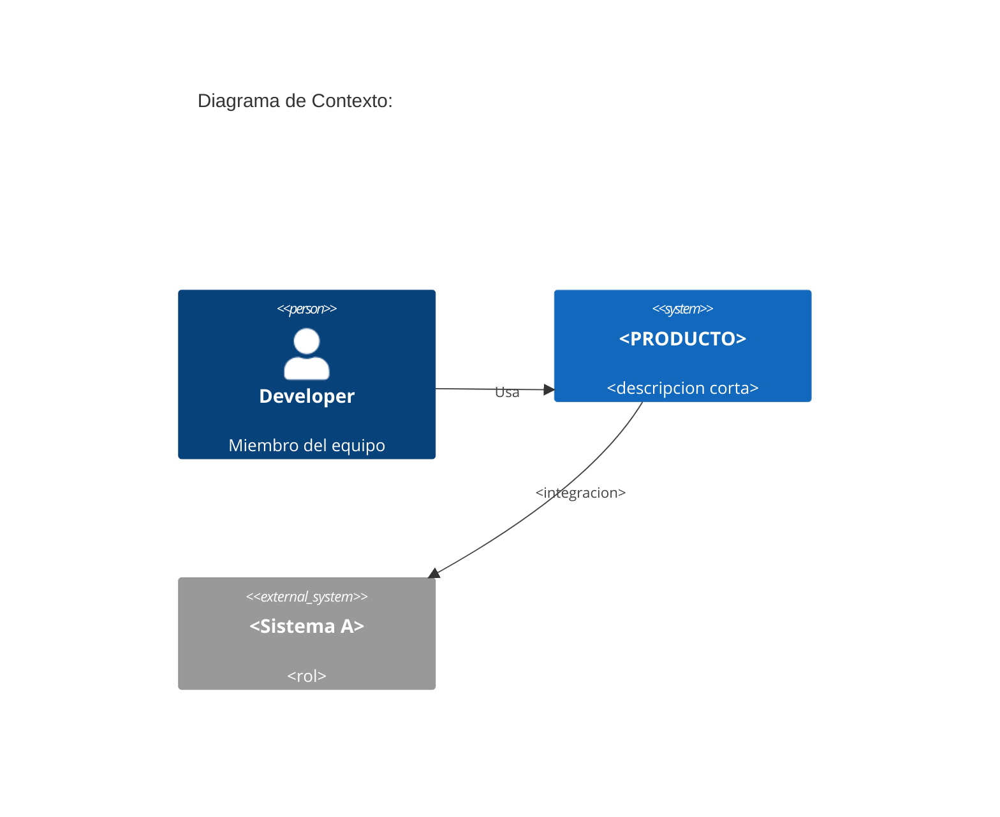
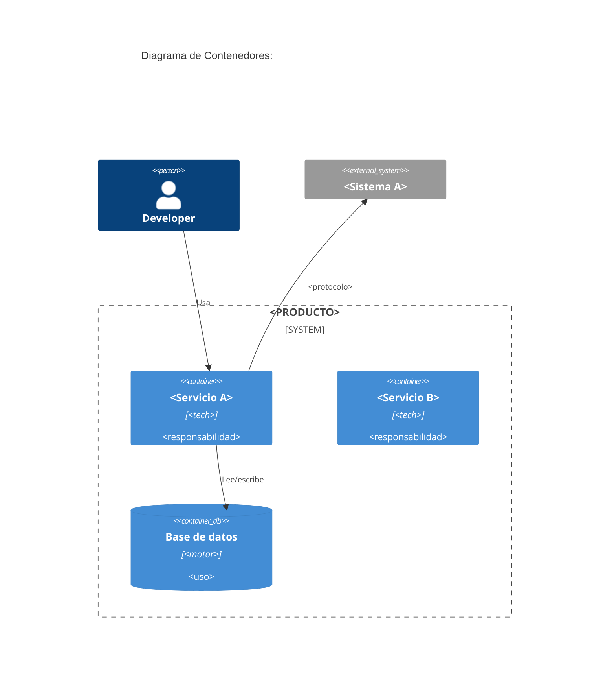
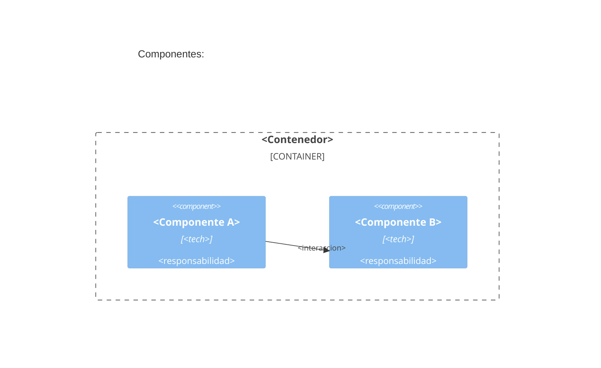
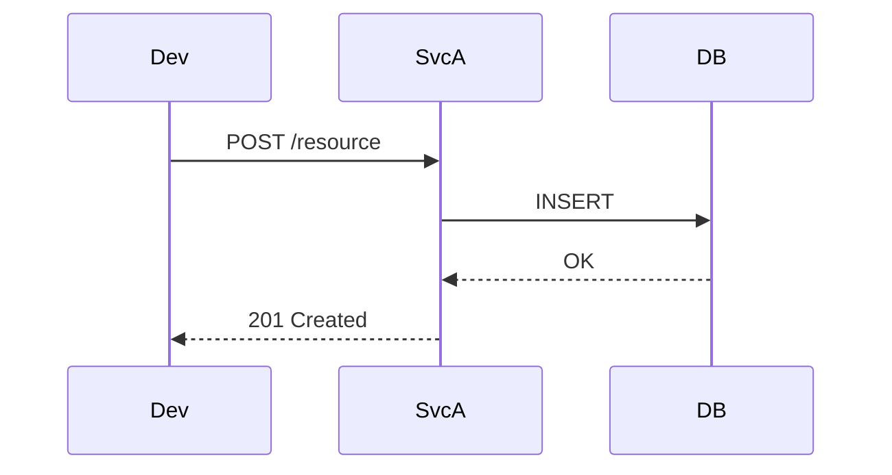
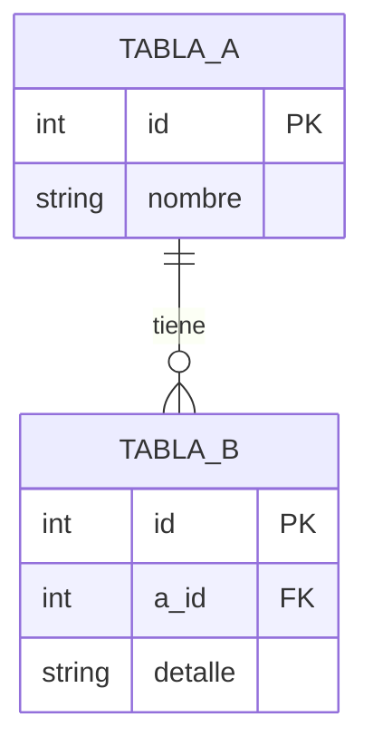

# diagrams — Diagram authoring capability

## Role

`diagrams` — built-in default implementation. Rebindable to another skill (third-party or `off`) in `.workflow/skills.toml`.

## Purpose

Author architecture diagrams with C4 notation (Levels 1-3) using the engine the export configures via `--engine`. It produces renderable source (Mermaid / DSL) — **it does not render visually**; the reader renders with their tools. Covers the default engine (native embedded Mermaid C4) and the opt-in `c4` (Structurizr DSL, formal C4).

## Composed by

| Export | When it composes it |
|---|---|
| `export-diagrams` | to generate the content of `docs/diagrams/NNN-*/` |

Any loop may also compose it to produce an inline diagram during execution (rare; the primary case is `export-diagrams`).

## Knowledge

### Engine matrix

The export picks the engine with `--engine mermaid|c4` (default `mermaid`):

| `--engine` | Engine | Files produced | When to pick it |
|---|---|---|---|
| `mermaid` (default) | Native Mermaid C4 | only `.md` with Mermaid blocks | Embedded render, no separate DSL; GitHub/GitLab render it inline |
| `c4` | Structurizr DSL | `workspace.dsl` + auxiliary Mermaid embedded in `.md` | Formal technical dossier; external tooling (structurizr.com, structurizr-lite) |

**Canonical rule**: `export-diagrams` uses **Mermaid** by default (`--engine mermaid`) — embedded render, no external tooling. `--engine c4` produces Structurizr DSL (formal C4, separates model from views) for the technical dossier.

### C4 model — levels

Diagram titles/labels are user-facing content → author them in the user's language (Spanish in the templates below).

#### Level 1: Context (C4Context)

The system as a single box + actors + neighbor systems. Business perspective.



#### Level 2: Container (C4Container)

Applications, services, data stores composing the system. One source declared in `WORKSPACE` = one container.



#### Level 3: Component (C4Component)

Relevant internal modules of one container. Only for containers with enough internal complexity. One diagram per container; the rest are omitted.



If no container justifies C4 Component → omit the section with the inline note `_(Sin contenedores con complejidad interna suficiente para C4 Component.)_`.

### Structurizr DSL template

```dsl
workspace "<PRODUCTO>" "<descripcion>" {

  model {
    // Personas
    dev = person "Developer" "Miembro del equipo"

    // Sistema bajo análisis
    sistema = softwareSystem "<PRODUCTO>" "<descripcion>" {
      svcA = container "<Servicio A>" "<tech>" "<responsabilidad>"
      svcB = container "<Servicio B>" "<tech>" "<responsabilidad>"
      db   = container "Base de datos" "<motor>" "<uso>" "Database"
    }

    // Sistemas externos
    extA = softwareSystem "<Sistema A>" "<rol>" "External"

    // Relaciones
    dev   -> sistema "Usa"
    svcA  -> db      "Lee/escribe"
    svcA  -> extA    "<protocolo>"
  }

  views {
    systemContext sistema "Context" {
      include *
      autoLayout
    }

    container sistema "Container" {
      include *
      autoLayout
    }

    // One view per container with relevant C4 Component:
    component svcA "SvcA-Components" {
      include *
      autoLayout
    }

    theme default
  }
}
```

Free online render: [structurizr.com/dsl](https://structurizr.com/dsl) or structurizr-lite (Docker).

### Auxiliary Mermaid (under `--engine c4`)

With `--engine c4`, the `.md` file also includes a Mermaid block derived from the DSL as an **offline fallback** (readers without access to structurizr.com/dsl can read it directly):

```
```mermaid
C4Context
  title ...
```

> See the rendered diagram: <https://mermaid.ink/img/BASE64>
```

`BASE64` is the plain Mermaid code encoded as URL-safe base64 (RFC 4648 §5; alphabet `A-Z a-z 0-9 - _`). **Every Mermaid block carries its own link** immediately after the closing fence.

### Sequence diagrams (opt-in)

For critical integration flows (not structural C4), a Mermaid `sequenceDiagram` complements the C4 Container:



Only when it adds real clarity — never add sequence diagrams by default.

### Entity-Relationship (data model)

When `export-diagrams` includes `--scope data` and an MCP is configured:



Read-only MCP: `\d <table>` + `SELECT count(*)` for magnitude (apply the cost guard: see the `research` or `sql` skill).

### Output file structure

```
docs/diagrams/NNN-export-diagrams-YYYY-MM-DD/
├── README.md            # index + how-to-read + engines used
├── diagrams.md          # main document with C4 + Mermaid (+ mermaid.ink links)
└── workspace.dsl        # only with --engine c4 (Structurizr)
```

### Render rules

1. No word cap — completeness > concision for technical documentation.
2. The main diagram (at least C4Context + C4Container) is mandatory; without them the output is not valid.
3. C4Component only when the container justifies it.
4. Sequence and erDiagram are optional; only when they add real clarity.
5. Every `mermaid` block carries the `mermaid.ink` link as an inline blockquote.
6. `{{PLACEHOLDER}}` placeholders always replaced — never leave unfilled markers.

## Output

Produces under `docs/diagrams/NNN-export-diagrams-YYYY-MM-DD/`:

- `README.md`
- `diagrams.md` (always)
- `workspace.dsl` (with `--engine c4`)

Writes only `docs/diagrams/` (invariants #1 and #2: only `export-*` graduates to `docs/`; this skill is composed by `export-diagrams`).

## Source

Rationale and history: design (`docs/referencias/workflow-roles/`).
