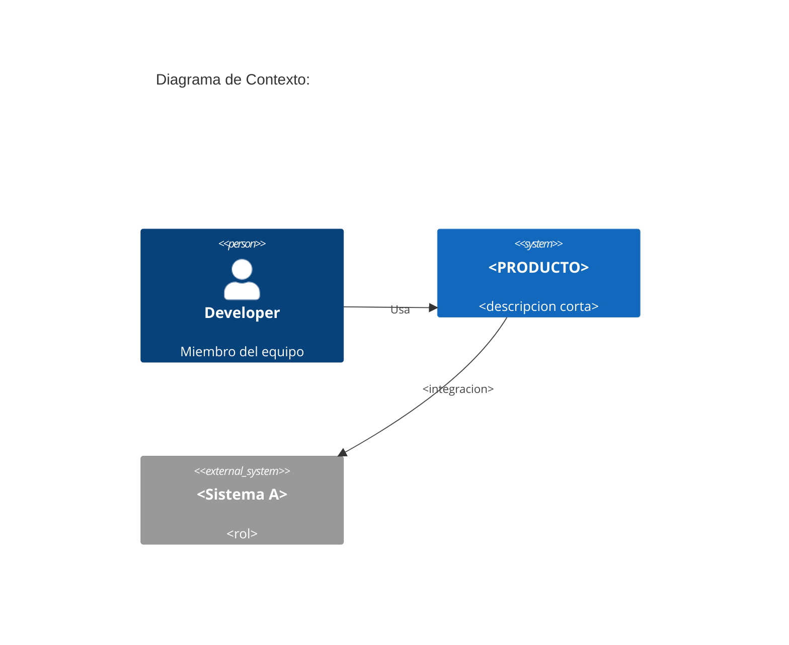
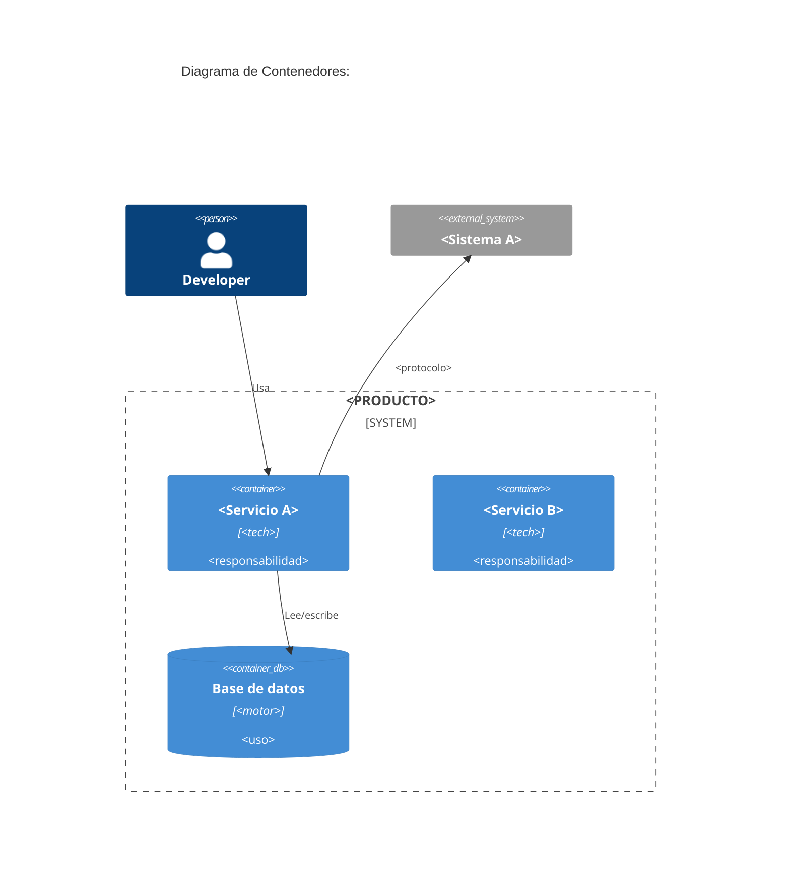
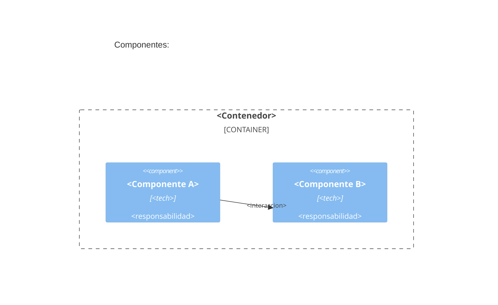
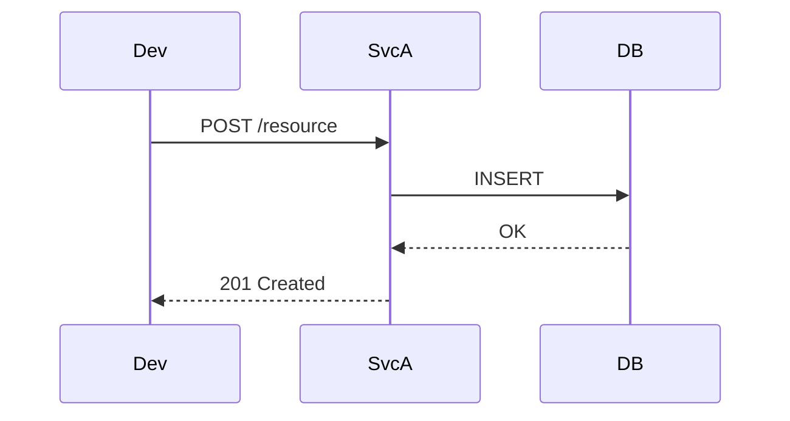
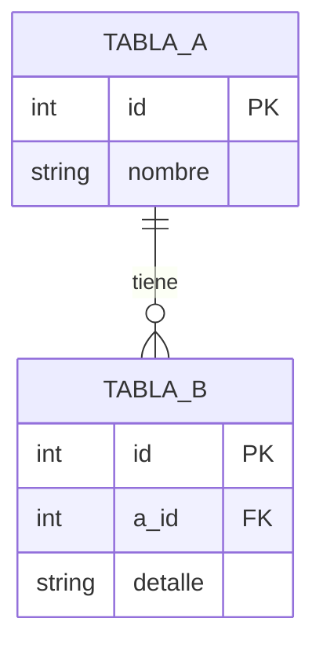

# diagrams — Diagram authoring capability

## Role

`diagrams` — implementación built-in por defecto. Rebindeable a otra skill (de tercero o `off`) en `.workflow/skills.toml`.

## Purpose

Autorar diagramas de arquitectura con notación C4 (Levels 1-3) usando el motor que el export configure vía `--engine`. Produce source renderizable (Mermaid / DSL) — **no renderiza visualmente**; el render lo hace el lector con sus herramientas. Cubre el motor por defecto (Mermaid C4 nativo, embebido) y el opt-in `c4` (Structurizr DSL, C4 formal).

## Composed by

| Export | Cuándo la compone |
|---|---|
| `export-diagrams` | para generar el contenido de `docs/diagrams/NNN-*/` |

Cualquier loop puede componerla también si necesita producir un diagrama inline durante ejecución (raro; el caso primario es `export-diagrams`).

## Knowledge

### Engine matrix

El export elige el motor con `--engine mermaid|c4` (default `mermaid`):

| `--engine` | Motor | Archivos producidos | Cuándo elegirlo |
|---|---|---|---|
| `mermaid` (default) | Mermaid C4 nativo | solo `.md` con bloques Mermaid | Render embebido sin DSL separado; GitHub/GitLab lo renderizan inline |
| `c4` | Structurizr DSL | `workspace.dsl` + Mermaid auxiliar embebido en `.md` | Dossier técnico formal; tooling externo (structurizr.com, structurizr-lite) |

**Regla canónica**: `export-diagrams` usa **Mermaid** por defecto (`--engine mermaid`) — render embebido sin tooling externo. `--engine c4` produce Structurizr DSL (C4 formal, separa modelo de vistas) para el dossier técnico.

### C4 model — levels

#### Level 1: Context (C4Context)

El sistema como caja única + actores + sistemas vecinos. Perspectiva de negocio.



#### Level 2: Container (C4Container)

Aplicaciones, servicios, data stores que componen el sistema. Una fuente declarada en `WORKSPACE` = un contenedor.



#### Level 3: Component (C4Component)

Módulos internos relevantes de un contenedor. Solo para contenedores con complejidad interna suficiente. Un diagrama por contenedor; el resto se omite.



Si ningún contenedor justifica C4 Component → omitir la sección con nota inline `_(Sin contenedores con complejidad interna suficiente para C4 Component.)_`.

### Structurizr DSL template

```dsl
workspace "<PRODUCTO>" "<descripcion>" {

  model {
    // Personas
    dev = person "Developer" "Miembro del equipo"

    // Sistema bajo análisis
    sistema = softwareSystem "<PRODUCTO>" "<descripcion>" {
      svcA = container "<Servicio A>" "<tech>" "<responsabilidad>"
      svcB = container "<Servicio B>" "<tech>" "<responsabilidad>"
      db   = container "Base de datos" "<motor>" "<uso>" "Database"
    }

    // Sistemas externos
    extA = softwareSystem "<Sistema A>" "<rol>" "External"

    // Relaciones
    dev   -> sistema "Usa"
    svcA  -> db      "Lee/escribe"
    svcA  -> extA    "<protocolo>"
  }

  views {
    systemContext sistema "Context" {
      include *
      autoLayout
    }

    container sistema "Container" {
      include *
      autoLayout
    }

    // Una vista por contenedor con C4 Component relevante:
    component svcA "SvcA-Components" {
      include *
      autoLayout
    }

    theme default
  }
}
```

Render online gratuito: [structurizr.com/dsl](https://structurizr.com/dsl) o structurizr-lite (Docker).

### PlantUML C4-stdlib template (motor extra, fuera del contrato actual)

> El contrato vigente de `export-diagrams` expone solo `--engine mermaid|c4` (no produce `.puml`). Esta plantilla queda como **referencia** para un export rebindeado/custom que quiera emitir PlantUML.

```plantuml
@startuml arquitectura

!include https://raw.githubusercontent.com/plantuml-stdlib/C4-PlantUML/master/C4_Context.puml
!include https://raw.githubusercontent.com/plantuml-stdlib/C4-PlantUML/master/C4_Container.puml
!include https://raw.githubusercontent.com/plantuml-stdlib/C4-PlantUML/master/C4_Component.puml

title <PRODUCTO> — Diagrama de Contexto C4

Person(dev, "Developer", "Miembro del equipo")
System(sistema, "<PRODUCTO>", "<descripcion>")
System_Ext(extA, "<Sistema A>", "<rol>")

Rel(dev, sistema, "Usa")
Rel(sistema, extA, "<protocolo>")

SHOW_LEGEND()
@enduml
```

Render: [plantuml.com](https://plantuml.com) o `plantuml.jar` local.

### Mermaid auxiliar (bajo `--engine c4`)

Cuando `--engine c4`, el archivo `.md` incluye también un bloque Mermaid derivado del DSL como **fallback offline** (lectores sin acceso a structurizr.com/dsl pueden leerlo directamente):

```
```mermaid
C4Context
  title ...
```

> Ver diagrama renderizado: <https://mermaid.ink/img/BASE64>
```

El `BASE64` es el código Mermaid plano codificado en base64 URL-safe (RFC 4648 §5; alfabeto `A-Z a-z 0-9 - _`). **Cada bloque Mermaid lleva su propio link** inmediatamente después del fence de cierre.

### Sequence diagrams (opt-in)

Para flujos críticos de integración (no C4 estructural), un `sequenceDiagram` Mermaid complementa el C4 Container:



Solo si aporta claridad real — no agregar sequence diagrams por defecto.

### Entity-Relationship (modelo de datos)

Cuando `export-diagrams` incluye `--scope data` y hay MCP configurado:



MCP read-only: `\d <tabla>` + `SELECT count(*)` para magnitud (aplicar cost guard: ver skill `research` o `sql`).

### Output file structure

```
docs/diagrams/NNN-export-diagrams-YYYY-MM-DD/
├── README.md            # índice + how-to-read + motores usados
├── diagrams.md          # documento principal con C4 + Mermaid (+ links mermaid.ink)
└── workspace.dsl        # solo con --engine c4 (Structurizr)
```

### Render rules

1. Sin cota de palabras — completitud > concisión para documentación técnica.
2. Diagrama principal (al menos C4Context + C4Container) es obligatorio; sin ellos el output no es válido.
3. C4Component solo si el contenedor lo justifica.
4. Sequence y erDiagram son opcionales; solo si aportan claridad real.
5. Cada bloque `mermaid` lleva el link `mermaid.ink` como blockquote inline.
6. Placeholders `{{PLACEHOLDER}}` siempre reemplazados — nunca dejar marcadores sin rellenar.

## Output

Produce en `docs/diagrams/NNN-export-diagrams-YYYY-MM-DD/`:
- `README.md`
- `diagrams.md` (siempre)
- `workspace.dsl` (si `--engine c4`)

Escribe solo `docs/diagrams/` (invariant #1 y #2: solo `export-*` gradua a `docs/`; esta skill la compone `export-diagrams`).

## Source

Reciclado de `agent-workflow/exports/export-arq/` del bundle viejo (v1.3.0). Se conserva: el modelo C4 Levels 1-3, las plantillas DSL/PUML, la regla de link `mermaid.ink` por bloque Mermaid, la estructura de output, el cost guard para MCP. Se moderniza al contrato vigente de `export-diagrams`: **Mermaid por defecto** (antes Structurizr), motor elegido por `--engine mermaid|c4` (lo recibe el export que compone esta skill); PlantUML queda como apéndice de referencia, fuera del contrato actual. Se descarta: la lógica de lectura de AW-PROJECT legacy y los comandos CLI `agent-workflow next-number`/`history-data`/etc. (detalles de implementación del CLI, no de la skill).
